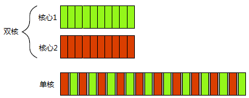
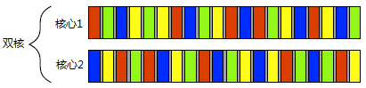
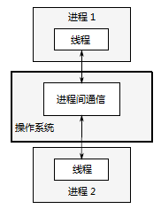
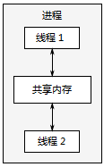

# 1.1 何谓并发

并发，指两个或两个以上的独立活动同时发生。

并发在生活中随处可见，我们可以一边走路一边说话，也可以两只手同时做不同的动作，还有每个人都过着相互独立的生活——当我在游泳的时候，你可以看球赛，等等。

## 1.1.1 计算机的并发

计算机的并发，指在单个系统里同时执行多个独立的任务。

并发在计算机领域不是一个新鲜事物。很多年前，一台计算机就能通过多任务操作系统的切换功能，同时运行多个应用，并且多处理器服务器很早就实现了并行计算。那并发为什么在计算机领域越来越流行呢？——真正的并行。

以前，大多数计算机只有一个处理器，具有单个处理单元或核芯。这种机器只能在某一时刻执行一个任务，不过可以在单位时间内对任务进行多次切换。通过“这个任务做一会，另一个任务再做一会儿”的方式，让任务看起来是并行的，这种方式称为任务切换。如今，这样的方式仍称为“并发“，因为任务切换得太快，以至于无法感觉到任务会的暂时挂起，任务切换会给用户造成一种“并发的假象”。任务切换和真正并发执行相比，行为上还是有着微妙的不同。

多核计算机用于高性能计算已有多年。基于单芯多核处理器(多核处理器)的台式机，也越来越大众化。无论有多少个处理器，这些机器都能够真正的并行多个任务，我们称其为”硬件并发“。

图1.1显示了处理两个任务时的理想情景，每个任务被分为10个相等大小的子任务块。在一个双核机器上，每个任务可以在各自的处理核心上执行。在单核机器上做任务切换时，每个任务的块交替进行，但中间有一小段分隔(图中所示灰色分隔条)，这表示切换任务的开销。进行任务切换时，操作系统必须保存当前任务CPU的状态和指令指针，并计算要切换到哪个任务，再将切换到的任务加载处理器中。CPU可能要将新任务的指令和数据载入到缓存，这会让CPU停止执行指令，从而造成的更多的延迟。

图 1.1 并发的两种方式：真正并行 vs. 任务切换

有些处理器可以在一个核心上执行多个线程，但硬件并发在多处理器上效果更加显著。硬件线程最重要的是数量，也就是可以并发运行独立任务的数量。即便是硬件并发的系统，也有比硬件“可并行最大任务数”还要多的任务需要执行，所以任务切换在这些情况下仍然适用。例如，一个台计算机上可能会有成百上千个的任务在运行，即便是在计算机处于空闲时，还是会有后台任务在运行。正是任务切换使得这些后台任务可以运行，这样系统使用者就可以同时运行文字处理器、编译器、编辑器和Web浏览器了。

图1.2显示了四个任务在双核处理器上的任务切换，仍是将任务整齐地划分为同等大小子任务块的理想情况。实际上，许多因素会使得任务分割不均或调度不规则。

图 1.2 四个任务在两个核心之间的切换

无论应用是在单核处理器，还是多核处理器上运行；也不论是任务切换，还是硬件并发，这里提到的技术、功能和类(本书所涉及的)都会涉及。如何使用并发，很大程度上取决于可用的硬件并发。

## 1.1.2 并发的方式

试想当两个程序员在两个独立的办公室一起做一个软件项目，他们可以安静地工作、互不干扰，并且人手一套参考手册。但沟通起来就有些困难，比起可以直接交谈，他们必须使用电话、电子邮件或到对方的办公室进行面对面交流。并且，管理两个办公室需要有一定的经费支出，还需要购买多份参考手册。

假设，让开发人员同在一间办公室办公，他们可以自由的对某个程序设计进行讨论，也可以在纸或白板上绘制图表，对设计观点进行辅助性阐释。现在，只需要管理一个办公室和一套参考资料就够了。遗憾的是，开发人员可能难以集中注意力，并且还可能存在资源共享的问题(比如，“参考手册哪去了?”)

以上两种方法，描绘了并发的两种基本途径。开发人员代表线程，办公室代表进程。第一种方式是每个进程只要一个线程，这就类似让每个开发人员拥有自己的办公室，而第二种方式是每个进程有多个线程，如同一个办公室里有两个开发人员。让我们在一个应用中，简单的分析一下这两种方式。

##### 多进程并发

使用并发的第一种方式，是将应用程序分为多个独立的进程同时运行，就像同时进行网页浏览和文字处理一样。如图1.3所示，独立的进程可以通过进程间的通信渠道传递讯息(信号、套接字、文件、管道等等)。不过，这种进程间的通信通常非常复杂，或是速度很慢。这是因为操作系统会对进程进行保护，以避免一个进程去修改另一个进程的数据。还有一个缺点是，运行多个进程的固定开销：需要时间启动进程，操作系统需要资源来管理进程，等等。

图 1.3 一对并发运行的进程之间的通信

当然，以上的机制也不是一无是处：操作系统在进程间提供的保护操作和更高级别的通信机制，可以更容易编写安全的并发代码。实际上，在类似于[Erlang](www.erlang.org)的编程环境中，会将进程作为并发的基础块。

使用多进程实现并发还有一个优势——可以使用远程连接(可能需要联网)的方式，在不同的机器上运行独立的进程。虽然，这增加了通信成本，但在设计精良的系统中，这是一种提高并行可用性和性能的低成本方案。

##### 多线程并发

并发的另一个途径，在单进程中运行多个线程。线程很像轻量级的进程：每个线程相互独立运行，并且可以在不同的指令序列中运行。不过，进程中的所有线程都共享地址空间，并且能访问到大部分数据———全局变量仍然是全局的，指针、对象的引用或数据可以在线程之间传递。虽然，进程之间通常共享内存，但同一数据的内存地址在不同的进程中不相同，所以这种共享难以建立和管理。图1.4展示了一个进程中的两个线程，正在通过共享内存进行通信。

图 1.4 同一进程中，一对并发线程间的通信

地址空间共享，以及缺少线程间的数据保护，使得操作系统记录的工作量减小，所以使用多线程的开销远远小于多进程。不过，共享内存的灵活性是有代价的：如果数据被多个线程访问，那么必须确保每个线程所访问到的数据是一致的，这也意味着需要对线程通信做大量的工作。

多个单线程/进程间的通信，要比单一进程中多线程通信的开销大，若不考虑共享内存可能带来的问题，多线程将会成为主流语言(包括C++)更青睐的并发方式。此外，C++标准并未对进程通信提供原生支持，所以实现会依赖于平台相关的API。因此，本书只关注多线程的并发，之后所提到“并发”，均为多线程实现。

多线程应用中，还有一种方式：并行。

## 1.1.3 并发与并行

对多线程来说，这两个概念大部分是重叠的。对于很多人来说，它们没有什么区别。这两个词是用来描述硬件同时执行多个任务的方式，而“并行”更加注重性能。使用硬件提高数据处理速度时，会讨论程序的并行性；当关注重点在于任务分离或任务响应时，会讨论程序的并发性。这两个术语存在的目的，就是为了区别多线程中不同的关注点。

了解了并发后，来看看为什么要使用并发。