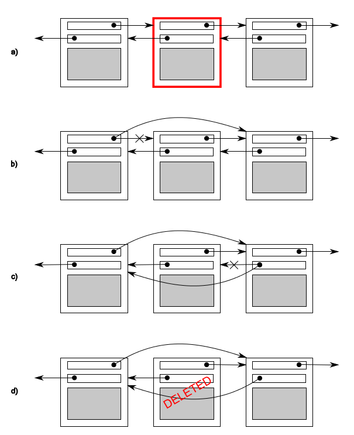

# 3.1 共享数据带来的问题

当涉及到共享数据时，问题很可能是因为共享数据修改所导致。如果共享数据是只读的，那么只读操作不会影响到数据，更不会涉及对数据的修改，所以所有线程都会获得同样的数据。但是，当一个或多个线程要修改共享数据时，就会产生很多麻烦。这种情况下，就必须小心谨慎，才能确保一切所有线程都工作正常。

*不变量*(invariants)的概念对程序员们编写的程序会有一定的帮助——对于特殊结构体的描述；比如，“变量包含列表中的项数”。不变量通常会在一次更新中被破坏，特别是比较复杂的数据结构，或者一次更新就要改动很大的数据结构。

双链表中每个节点都有一个指针指向列表中下一个节点，还有一个指针指向前一个节点。其中不变量就是节点A中指向“下一个”节点B的指针，还有前向指针。为了从列表中删除一个节点，其两边节点的指针都需要更新。当其中一边更新完成时，不变量就被破坏了，直到另一边也完成更新；在两边都完成更新后，不变量就又稳定了。

从一个列表中删除一个节点的步骤如下(如图3.1)

   a. 找到要删除的节点N 

   b. 更新前一个节点指向N的指针，让这个指针指向N的下一个节点 

   c. 更新后一个节点指向N的指针，让这个指正指向N的前一个节点 

   d. 删除节点N 

图3.1 从一个双链表中删除一个节点

图中b和c在相同的方向上指向和原来已经不一致了，这就破坏了不变量。

线程间潜在问题就是修改共享数据，致使不变量遭到破坏。当不做些事来确保在这个过程中不会有其他线程进行访问的话，可能就有线程访问到刚刚删除一边的节点；这样的话，线程就读取到要删除节点的数据(因为只有一边的连接被修改，如图3.1(b))，所以不变量就被破坏。破坏不变量的后果是多样，当其他线程按从左往右的顺序来访问列表时，它将跳过被删除的节点。在一方面，如有第二个线程尝试删除图中右边的节点，那么可能会让数据结构产生永久性的损坏，使程序崩溃。无论结果如何，都是并行代码常见错误：*条件竞争*(race condition)。

## 3.1.1 条件竞争

假设你去电影院买电影票。如果去的是一家大电影院，有很多收银台，很多人就可以在同一时间买电影票。当另一个收银台也在卖你想看的这场电影的电影票，那么你的座位选择范围就取决于在之前已预定的座位。当只有少量的座位剩下，这就意味着，这可能是一场抢票比赛，看谁能抢到最后一张票。这就是一个条件竞争的例子：你的座位(或者你的电影票)都取决于两种购买方式的相对顺序。

并发中竞争条件的形成，取决于一个以上线程的相对执行顺序，每个线程都抢着完成自己的任务。大多数情况下，即使改变执行顺序，也是良性竞争，其结果可以接受。例如，有两个线程同时向一个处理队列中添加任务，因为系统提供的不变量保持不变，所以谁先谁后都不会有什么影响。当不变量遭到破坏时，才会产生条件竞争，比如双向链表的例子。并发中对数据的条件竞争通常表示为恶性条件竞争，我们对不产生问题的良性条件竞争不感兴趣。`C++`标准中也定义了数据竞争这个术语，一种特殊的条件竞争：并发的去修改一个独立对象(参见5.1.2节)，数据竞争是(可怕的)未定义行为的起因。

恶性条件竞争通常发生于完成对多于一个的数据块的修改时，例如，对两个连接指针的修改(如图3.1)。因为操作要访问两个独立的数据块，独立的指令将会对数据块将进行修改，并且其中一个线程可能正在进行时，另一个线程就对数据块进行了访问。因为出现的概率太低，条件竞争很难查找，也很难复现。如CPU指令连续修改完成后，即使数据结构可以让其他并发线程访问，问题再次复现的几率也相当低。当系统负载增加时，随着执行数量的增加，执行序列的问题复现的概率也在增加，这样的问题只可能会出现在负载比较大的情况下。条件竞争通常是时间敏感的，所以程序以调试模式运行时，它们常会完全消失，因为调试模式会影响程序的执行时间(即使影响不多)。

当你以写多线程程序为生，条件竞争就会成为你的梦魇；编写软件时，我们会使用大量复杂的操作，用来避免恶性条件竞争。

## 3.1.2 避免恶性条件竞争

这里提供一些方法来解决恶性条件竞争，最简单的办法就是对数据结构采用某种保护机制，确保只有进行修改的线程才能看到不变量被破坏时的中间状态。从其他访问线程的角度来看，修改不是已经完成了，就是还没开始。`C++`标准库提供很多类似的机制，下面会逐一介绍。

另一个选择是对数据结构和不变量的设计进行修改，修改完的结构必须能完成一系列不可分割的变化，也就是保证每个不变量保持稳定的状态，这就是所谓的无锁编程。不过，这种方式很难得到正确的结果。如果到这个级别，无论是内存模型上的细微差异，还是线程访问数据的能力，都会让工作变的复杂。内存模型将在第5章讨论，无锁编程将在第7章讨论。

另一种处理条件竞争的方式是，使用事务的方式去处理数据结构的更新(这里的"处理"就如同对数据库进行更新一样)。所需的一些数据和读取都存储在事务日志中，然后将之前的操作合为一步，再进行提交。当数据结构被另一个线程修改后，或处理已经重启的情况下，提交就会无法进行，这称作为“软件事务内存”。理论研究中，这是一个很热门的研究领域。这个概念将不会在本书中再进行介绍，因为在`C++`中没有对STM进行直接支持(尽管C++有事务性内存扩展的技术规范[1])。但是，基本思想会在后面提及。

保护共享数据结构的最基本的方式，是使用C++标准库提供的互斥量。

-----

[1] SO/IEC TS 19841:2015—Technical Specification for C++ Extensions for Transactional Memory http://www.iso.org/iso/home/store/catalogue_tc/catalogue_detail.htm?csnumber=66343 .