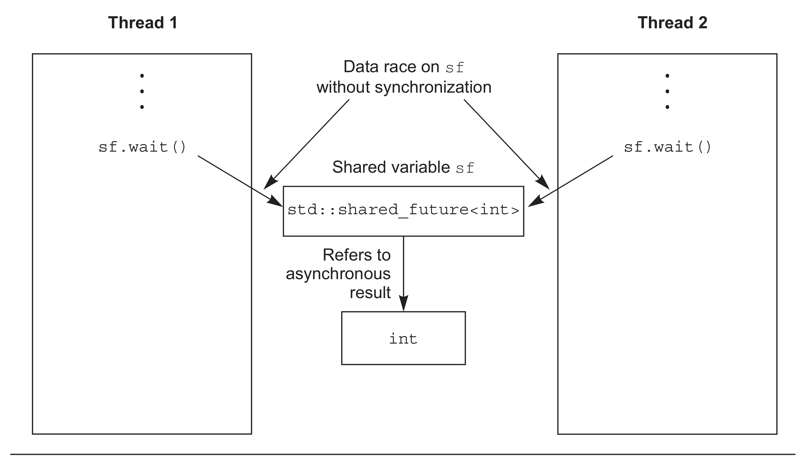

# 4.2 使用期望值等待一次性事件

假设你乘飞机去国外度假。当你到达机场并办理完各种登机手续后，还需要等待机场广播通知登机时(可能要等很多个小时)，你可能会在候机室里面找一些事情来打发时间，比如：读书，上网，或者来一杯价格不菲的机场咖啡。不过，从根本上来说你就在等待一件事情：机场广播能够登机的时间。之前飞机的班次在之后没有可参考性，因为当你在再次度假的时候，可能会选择等待另一班飞机。

C++标准库模型将这种一次性事件称为*期望值*(future)。当线程需要等待特定的一次性事件时，某种程度上来说就需要知道这个事件在未来的期望结果。之后，这个线程会周期性(较短的周期)的等待或检查，事件是否触发(检查信息板)；检查期间也会执行其他任务(品尝昂贵的咖啡)。另外，等待任务期间它可以先执行另外一些任务，直到对应的任务触发，而后等待期望值的状态会变为*就绪*(ready)。一个期望值可能是数据相关的(比如，你的登机口编号)，也可能不是。当事件发生时(并且期望状态为就绪)，并且这个期望值就不能被重置。

C++标准库中，有两种期望值，使用两种类型模板实现，声明在`<future>`头文件中: *唯一期望值*(unique futures)(`std::future<>`)和*共享期望值*(shared futures)(`std::shared_future<>`)。仿照了`std::unique_ptr`和`std::shared_ptr`。`std::future`的实例只能与一个指定事件相关联，而`std::shared_future`的实例就能关联多个事件。后者的实现中，所有实例会在同时变为就绪状态，并且他们可以访问与事件相关的任何数据。这种数据关联与模板有关，比如`std::unique_ptr` 和`std::shared_ptr`的模板参数就是相关联的数据类型。与数据无关处，可以使用`std::future<void>`与`std::shared_future<void>`的特化模板。虽然，我希望用于线程间的通讯，但是期望值对象本身并不提供同步访问。当多个线程需要访问一个独立期望值对象时，必须使用互斥量或类似同步机制对访问进行保护，如在第3章所述。不过，在将要阅读到的4.2.5节中，多个线程会对一个`std::shared_future<>`实例的副本进行访问，即使他们是同一个异步结果，也不需要同步期望值。

并行技术规范将这两个模板类在`std::experimental`命名空间中进行了扩展：`std::experimental::future<>`和`std::experimental::shared_future<> `。这个命名空间就是为了将其与`std`命名空间中的模板类进行区分，实验性的命名空间中为这两个模板类添加了更多的功能。尤为重要的是`std::experimental`中的内容与代码质量无关(我希望这里也会有较高质量的实现)，需要强调是这个命名空间提供的类和函数都不是标准的，这个命名空间中类和函数的语法和语义，很可能与纳入C++标准(也就是`std`命名空间)后有所不同。如果想要使用这两个试验性的模板类，需要包含`<experimental/future>`头文件。

最简单的一次性事件，就是一个后台运行出的计算结果。第2章中已经清楚了`std::thread` 执行的任务不能有返回值，并且我能保证，这个问题将在使用期望值解决——现在就来看看是怎么解决的。

### 4.2.1 后台任务的返回值

假设，你有一个需要长时间的运算，你需要其能计算出一个有效的值，但是你现在并不迫切需要这个值。可能你已经找到了生命、宇宙，以及万物的答案，就像道格拉斯·亚当斯[1]一样。你可以启动一个新线程来执行这个计算，这就意味着你需要计算的结果，因为`std::thread`并不提供直接接收返回值的机制。这里就需要`std::async`函数模板(也是在头文`<future>`中声明的)。

当不着急要任务结果时，可以使用`std::async`启动一个异步任务。与`std::thread`对象等待的方式不同，`std::async`会返回一个`std::future`对象，这个对象持有最终计算出来的结果。当需要这个值时，只需要调用这个对象的get()成员函数；并且会阻塞线程直到期望值状态为就绪为止；之后，返回计算结果。下面清单中代码就是一个简单的例子。

清单4.6 使用`std::future`从异步任务中获取返回值

```c++
#include <future>
#include <iostream>

int find_the_answer_to_ltuae();
void do_other_stuff();
int main()
{
  std::future<int> the_answer=std::async(find_the_answer_to_ltuae);
  do_other_stuff();
  std::cout<<"The answer is "<<the_answer.get()<<std::endl;
}
```

与`std::thread` 做的方式一样，`std::async`允许你通过添加额外的调用参数，向函数传递额外的参数。当第一个参数是一个指向成员函数的指针，第二个参数提供有这个函数成员类的具体对象(不是直接的，就是通过指针，还可以包装在`std::ref`中)，剩余的参数可作为成员函数的参数传入。否则，第二个和随后的参数将作为函数的参数，或作为指定可调用对象的第一个参数。就如`std::thread`，当参数为右值时，拷贝操作将使用移动的方式转移原始数据。这就允许使用“只移动”类型作为函数对象和参数。来看一下下面的程序清单：

 清单4.7 使用`std::async`向函数传递参数

```c++
#include <string>
#include <future>
struct X
{
  void foo(int,std::string const&);
  std::string bar(std::string const&);
};
X x;
auto f1=std::async(&X::foo,&x,42,"hello");  // 调用p->foo(42, "hello")，p是指向x的指针
auto f2=std::async(&X::bar,x,"goodbye");  // 调用tmpx.bar("goodbye")， tmpx是x的拷贝副本
struct Y
{
  double operator()(double);
};
Y y;
auto f3=std::async(Y(),3.141);  // 调用tmpy(3.141)，tmpy通过Y的移动构造函数得到
auto f4=std::async(std::ref(y),2.718);  // 调用y(2.718)
X baz(X&);
std::async(baz,std::ref(x));  // 调用baz(x)
class move_only
{
public:
  move_only();
  move_only(move_only&&)
  move_only(move_only const&) = delete;
  move_only& operator=(move_only&&);
  move_only& operator=(move_only const&) = delete;
  
  void operator()();
};
auto f5=std::async(move_only());  // 调用tmp()，tmp是通过std::move(move_only())构造得到
```

默认情况下，期望值是否等待取决于`std::async`是否启动一个线程，或是否有任务正在进行同步。大多数情况下(估计这就是你想要的结果)，也可以在函数调用之前向`std::async`传递一个额外参数，这个参数的类型是`std::launch`，还可以是`std::launch::defered`，表明函数调用被延迟到wait()或get()函数调用时才执行，`std::launch::async` 表明函数必须在其所在的独立线程上执行，`std::launch::deferred | std::launch::async`表明实现可以选择这两种方式的一种。最后一个选项是默认的，当函数调用被延迟，它可能不会在运行了。如下所示：

```c++
auto f6=std::async(std::launch::async,Y(),1.2);  // 在新线程上执行
auto f7=std::async(std::launch::deferred,baz,std::ref(x));  // 在wait()或get()调用时执行
auto f8=std::async(
              std::launch::deferred | std::launch::async,
              baz,std::ref(x));  // 实现选择执行方式
auto f9=std::async(baz,std::ref(x));
f7.wait();  //  调用延迟函数
```

本章的后面和第8章中，将会再次看到这段程序，使用`std::async`会更容易让算法分割到各个任务中，这样程序就能并发的执行了。不过，这不是让`std::future`与任务实例相关联的唯一方式；你也可以将任务包装入`std::packaged_task<>`实例中，或通过编写代码的方式，使用`std::promise<>`类型模板显示设置值。与`std::promise<>`对比，`std::packaged_task<>`具有更高层的抽象，所以我们从“高抽象”的模板说起。

### 4.2.2 任务与期望值关联

`std::packaged_task<>`对一个函数或可调用对象，绑定一个期望值。当调用`std::packaged_task<>` 对象时，它就会调用相关函数或可调用对象，将期望状态置为就绪，返回值也会被存储。这可以用在构建线程池的结构单元(可见第9章)，或用于其他任务的管理，比如：在任务所在线程上运行其他任务，或将它们顺序的运行在一个特殊的后台线程上。当一个粒度较大的操作被分解为独立的子任务时，其中每个子任务都可以包含在一个`std::packaged_task<>`实例中，之后这个实例将传递到任务调度器或线程池中。对任务细节进行抽象，调度器仅处理`std::packaged_task<>`实例，而非处理单独的函数。

`std::packaged_task<>`的模板参数是一个函数签名，比如void()就是一个没有参数也没有返回值的函数，或int(std::string&, double*)就是有一个非const引用的`std::string`和一个指向double类型的指针，并且返回类型是int。当构造出一个`std::packaged_task<>`实例时，就必须传入一个函数或可调用对象；这个函数或可调用的对象，需要能接收指定的参数和返回可转换为指定返回类型的值。类型可以不完全匹配，可以用一个int类型的参数和返回一个float类型的函数，来构建`std::packaged_task<double(double)>`的实例，因为这里类型可以隐式转换。

函数签名的返回类型可以用来标识从get_future()返回的`std::future<>`的类型，而函数签名的参数列表，可用来指定packaged_task的函数调用操作符。例如，模板偏特化`std::packaged_task<std::string(std::vector<char>*,int)>`将在下面的代码清单中使用。

清单4.8 `std::packaged_task<>`的偏特化

```c++
template<>
class packaged_task<std::string(std::vector<char>*,int)>
{
public:
  template<typename Callable>
  explicit packaged_task(Callable&& f);
  std::future<std::string> get_future();
  void operator()(std::vector<char>*,int);
};
```

因为`std::packaged_task`对象是一个可调用对象，所以可以封装在`std::function`对象中，从而作为线程函数传递到`std::thread`对象中，或作为可调用对象传递另一个函数中，或可以直接进行调用。当`std::packaged_task`作为一个函数被调用时，实参将由函数调用操作符传递到底层函数，并且返回值作为异步结果存储在`std::future`，可通过get_future()获取。因此你可以把用`std::packaged_task`打包任务，并在它被传到别处之前的适当时机取回期望值。当需要异步任务的返回值时，你可以等待期望的状态变为“就绪”。下面的代码就是这么个情况。

**线程间传递任务**

很多图形架构需要特定的线程去更新界面，所以当一个线程对界面的更新时，它要发出一条信息给正确的线程，让特定的线程来做界面更新。`std::packaged_task`提供了实现这种功能的方法，且不需要发送一条自定义信息给图形界面相关线程。下面来看看代码。

清单4.9 使用`std::packaged_task`执行一个图形界面线程

```c++
#include <deque>
#include <mutex>
#include <future>
#include <thread>
#include <utility>

std::mutex m;
std::deque<std::packaged_task<void()> > tasks;

bool gui_shutdown_message_received();
void get_and_process_gui_message();

void gui_thread()  // 1
{
  while(!gui_shutdown_message_received())  // 2
  {
    get_and_process_gui_message();  // 3
    std::packaged_task<void()> task;
    {
      std::lock_guard<std::mutex> lk(m);
      if(tasks.empty())  // 4
        continue;
      task=std::move(tasks.front());  // 5
      tasks.pop_front();
    }
    task();  // 6
  }
}

std::thread gui_bg_thread(gui_thread);

template<typename Func>
std::future<void> post_task_for_gui_thread(Func f)
{
  std::packaged_task<void()> task(f);  // 7
  std::future<void> res=task.get_future();  // 8
  std::lock_guard<std::mutex> lk(m);
  tasks.push_back(std::move(task));  // 9
  return res; // 10
}
```

这段代码十分简单：图形界面线程①循环直到收到一条关闭图形界面的信息后关闭②，进行轮询界面消息处理③，例如：用户点击和执行在队列中的任务。当队列中没有任务④，它将再次循环；除非，它能在队列中提取出一个任务⑤，然后释放队列上的锁，并且执行任务⑥。这里，期望值与任务相关，当任务执行完成时，其状态会被置为“就绪”状态。

将一个任务传入队列：提供的函数⑦可以提供一个打包好的任务，可以通过这个任务⑧调用get_future()成员函数获取期望值对象，并且在任务被推入列表⑨之前，期望值将返回调用函数⑩。当需要知道线程执行完任务时，向图形界面线程发布消息的代码，会等待期望值改变状态；否则，会丢弃这个期望值。

例子中使用`std::packaged_task<void()>`创建任务，其包含了一个无参数无返回值的函数或可调用对象(如果当这个调用有返回值时，返回值会被丢弃)。这可能是最简单的任务，如你之前所见，`std::packaged_task`也可以用于一些复杂的情况——通过指定一个不同的函数签名作为模板参数，不仅可以改变其返回类型(因此该类型的数据会存在期望相关的状态中)，也可以改变函数操作符的参数类型。这个例子可以简单的扩展成允许任务运行在图形界面线程上，且接受传参，还有通过`std::future`获取返回值，而不仅仅是完成一个指标。

这些任务能作为一个简单的函数调用来表达吗？还有，任务的结果能从很多地方得到吗？这些问题可以使用第三种方法创建期望值来解决：使用`std::promise`对值进行显示设置。

### 4.2.3 使用(std::)promises

当一个应用需要处理很多网络连接时，它会使用不同线程尝试连接每个接口，因为这能使网络尽早联通，尽早执行程序。当连接较少的时候，工作没有问题(也就是线程数量比较少)。不幸的是，随着连接数量的增长，这种方式变的越来越不合适；因为大量的线程会消耗大量的系统资源，还有可能造成线程上下文频繁切换(当线程数量超出硬件可接受的并发数时)，这都会对性能有影响。最极端的例子：系统资源被创建的线程消耗殆尽，系统连接网络的能力会变的极差。因此通过少数线程(可能只有一个)处理网络连接，每个线程同时处理多个连接事件，对需要处理大量的网络连接的应用而言是普遍的做法。

考虑一个线程处理多个连接事件，来自不同的端口连接的数据包基本上是以乱序方式进行处理的；同样的，数据包也将以乱序的方式进入队列。很多情况下，另一些应用不是等待数据成功的发送，就是等待一批(新的)来自指定网络接口的数据接收成功。

`std::promise<T>`提供设定值的方式(类型为T)，这个类型会和后面看到的`std::future<T>` 对象相关联。一对`std::promise/std::future`会为这种方式提供一个可行的机制；期望值可以阻塞等待线程，同时，提供数据的线程可以使用组合中的*承诺值*来对相关值进行设置，并将期望值的状态置为“就绪”。

可以通过一个给定的`std::promise`的get_future()成员函数来获取与之相关的`std::future`对象，跟`std::packaged_task`的用法类似。当承诺值已经设置完毕(使用set_value()成员函数)，对应期望值的状态变为“就绪”，并且可用于检索已存储的值。当在设置值之前销毁`std::promise`，将会存储一个异常。在4.2.4节中，会详细描述异常是如何传送到线程的。

清单4.10中，单线程处理多接口的实现，如同之前所说，在这个例子中，可以使用一对`std::promise<bool>/std::future<bool>`找出一块传出成功的数据块；与期望值相关的只是一个简单的“成功/失败”标识。对于传入包，与期望值相关的数据就是数据包的有效负载。

清单4.10 使用承诺值解决单线程多连接问题

```c++
#include <future>

void process_connections(connection_set& connections)
{
  while(!done(connections))  // 1
  {
    for(connection_iterator  // 2
            connection=connections.begin(),end=connections.end();
          connection!=end;
          ++connection)
    {
      if(connection->has_incoming_data())  // 3
      {
        data_packet data=connection->incoming();
        std::promise<payload_type>& p=
            connection->get_promise(data.id);  // 4
        p.set_value(data.payload);
      }
      if(connection->has_outgoing_data())  // 5
      {
        outgoing_packet data=
            connection->top_of_outgoing_queue();
        connection->send(data.payload);
        data.promise.set_value(true);  // 6
      }
    }
  }
}
```

函数process_connections()中，直到done()返回true①为止。每一次循环，都会依次的检查每一个连接②，检索是否有数据③或正在发送已入队的传出数据⑤。假设输入数据包是具有ID和有效负载的(有实际的数在其中)。一个ID映射到一个`std::promise`(可能是在相关容器中进行的依次查找)④，并且值是设置在包的有效负载中的。对于传出包，包是从传出队列中进行检索的，实际上从接口直接发送出去。当发送完成，与传出数据相关的承诺值将置为true，来表明传输成功⑥。是否能映射到实际网络协议上，取决于网络所用协议；这里的“承诺值/期望值”组合方式可能在特殊的情况下无法工作，但它与一些操作系统支持的异步输入/输出结构类似。

上面的代码完全不理会异常，它可能在想象的世界中，一切工作都会很好的执行，但是这有悖常理。有时候磁盘满载，有时候会找不到东西，有时候网络会断，还有时候数据库会崩溃。当需要某个操作的结果时，就需要在对应的线程上执行这个操作，因为代码可以通过一个异常来报告错误；不过，这会对使用`std::packaged_task`或`std::promise`带来一些不必要的限制(在所有工作都正常的情况下)。因此，C++标准库提供了一种在以上情况下清理异常的方法，并且允许他们将异常存储为相关结果的一部分。

### 4.2.4 将异常存与期望值中

看完下面短小的代码段，思考一下，当你传递-1到square_root()中时，它将抛出一个异常，并且让这个异常被调用者看到：

```c++
double square_root(double x)
{
  if(x<0)
  {
    throw std::out_of_range(“x<0”);
  }
  return sqrt(x);
}
```

假设调用square_root()函数不是当前线程，

```c++
double y=square_root(-1);
```

将调用改为异步调用：

```c++
std::future<double> f=std::async(square_root,-1);
double y=f.get();
```

如果行为是完全相同时，其结果是理想的；任何情况下，y获得函数调用的结果，当线程调用f.get()时，就能再看到异常了，即使在一个单线程例子中。

好吧，事实的确如此：函数作为`std::async`的一部分时，当调用抛出一个异常时，这个异常就会存储到期望值中，之后期望值的状态被置为“就绪”，之后调用get()会抛出这个已存储异常(注意：标准级别没有指定重新抛出的这个异常是原始的异常对象，还是一个拷贝；不同的编译器和库将会在这方面做出不同的选择)。将函数打包入`std::packaged_task`任务包中后，到任务被调用时，同样的事情也会发生；打包函数抛出一个异常，这个异常将被存储在期望值中，准备在get()调用时再次抛出。

当然，通过函数的显式调用，`std::promise`也能提供同样的功能。当存入的是一个异常而非一个数值时，就需要调用set_exception()成员函数，而非set_value()。这通常是用在一个catch块中，并作为算法的一部分，为了捕获异常，使用异常填充承诺值：

```c++
extern std::promise<double> some_promise;
try
{
  some_promise.set_value(calculate_value());
}
catch(...)
{
  some_promise.set_exception(std::current_exception());
}
```

这里使用了`std::current_exception()`来检索抛出的异常，可用`std::copy_exception()`作为一个替代方案，`std::copy_exception()`会直接存储一个新的异常而不抛出：

```c++
some_promise.set_exception(std::copy_exception(std::logic_error("foo ")));
```

这比使用try/catch块更加清晰，当异常类型已知，就应该优先被使用；不是因为代码实现简单，而是它给编译器提供了极大的代码优化空间。

另一种向期望值中存储异常的方式是，在没有调用承诺值上的任何设置函数前，或正在调用包装好的任务时，销毁与`std::promise`或`std::packaged_task`相关的期望值对象。任何情况下，当期望值的状态还不是“就绪”时，调用`std::promise`或`std::packaged_task`的析构函数，将会存储一个与`std::future_errc::broken_promise`错误状态相关的`std::future_error`异常；通过创建一个期望值，可以构造一个承诺值为其提供值或异常；可以通过销毁值和异常源，去违背承诺值。这种情况下，编译器没有在期望值中存储任何东西，等待线程可能会永远的等下去。

直到现在，例子都在用`std::future`。不过，`std::future`也有局限性。很多线程在等待的时候，只有一个线程能获取等待结果。当多个线程需要等待相同的事件的结果，就需要使用`std::shared_future`来替代`std::future`了。

### 4.2.5 多个线程的等待

虽然`std::future`可以处理所有在线程间数据转移的同步，但是调用某一特殊` std::future`对象的成员函数，就会让这个线程的数据和其他线程的数据不同步。多线程在没有额外同步的情况下，访问一个独立的`std::future`对象时，就会有数据竞争和未定义的行为。这是因为`std::future`模型独享同步结果的所有权，并且通过调用get()函数，一次性的获取数据，这就让并发访问变的毫无意义——只有一个线程可以获取结果值，因为在第一次调用get()后，就没有值可以再获取了。

如果并行代码没有办法让多个线程等待同一个事件，先别太失落，`std::shared_future`可以来帮你解决。因为`std::future`是只移动的，所以其所有权可以在不同的实例中互相传递，但是只有一个实例可以获得特定的同步结果，而`std::shared_future`实例是可拷贝的，所以多个对象可以引用同一关联期望值的结果。

每一个`std::shared_future`的独立对象上，成员函数调用返回的结果还是不同步的，所以为了在多个线程访问一个独立对象时避免数据竞争，必须使用锁来对访问进行保护。优先使用的办法：为了替代只有一个拷贝对象的情况，可以让每个线程都拥有自己对应的拷贝对象。这样，当每个线程都通过自己拥有的`std::shared_future`对象获取结果，那么多个线程访问共享同步结果就是安全的。可见图4.1。



 

图4.1 使用多个`std::shared_future`对象来避免数据竞争

可能会使用`std::shared_future`的情况，例如：实现类似于复杂的电子表格的并行执行；每一个单元格有单一的终值，这个终值可能是由其他单元格中的数据通过公式计算得到的。公式计算得到的结果依赖于其他单元格，然后可以使用一个`std::shared_future`对象引用第一个单元格的数据。当每个单元格内的所有公式并行执行后，任务会以期望的方式完成工作；不过，当其中有计算需要依赖其他单元格的值，那么它就会被阻塞，直到依赖单元格的数据准备就绪。这将让系统在最大程度上使用硬件并发。

`std::shared_future`的实例同步`std::future`实例的状态。当`std::future`对象没有与其他对象共享同步状态所有权，那么所有权必须使用`std::move`将所有权传递到`std::shared_future`，其默认构造函数如下：

```c++
std::promise<int> p;
std::future<int> f(p.get_future());
assert(f.valid());  // 1 期望值 f 是合法的
std::shared_future<int> sf(std::move(f));
assert(!f.valid());  // 2 期望值 f 现在是不合法的
assert(sf.valid());  // 3 sf 现在是合法的
```

这里，期望值f开始是合法的①，因为它引用的是承诺值p的同步状态，但是在转移sf的状态后，f就不合法了②，而sf就是合法的了③。

如其他可移动对象一样，转移所有权是对右值的隐式操作，所以可以通过`std::promise`对象的成员函数get_future()的返回值，直接构造一个`std::shared_future`对象，例如：

```c++
std::promise<std::string> p;
std::shared_future<std::string> sf(p.get_future());  // 1 隐式转移所有权
```

转移所有权是隐式的，用一个右值构造`std::shared_future<>`，得到`std::future<std::string>`类型的实例①。

`std::future`的这种特性，可促进`std::shared_future`的使用，容器可以自动的对类型进行推断，从而初始化这个类型的变量(详见附录A，A.6节)。`std::future`有一个share()成员函数，可用来创建新的`std::shared_future` ，并且可以直接转移期望值的所有权。这样也就能保存很多类型，并且使得代码易于修改：

```c++
std::promise< std::map< SomeIndexType, SomeDataType, SomeComparator,
     SomeAllocator>::iterator> p;
auto sf=p.get_future().share();
```

这个例子中，sf的类型推到为`std::shared_future<std::map<SomeIndexType, SomeDataType, SomeComparator, SomeAllocator>::iterator>`，一口气还真的很难念完。当比较器或分配器有所改动，你只需要对承诺值的类型进行修改即可；期望值的类型会自动更新，与承诺值的修改进行匹配。

有时你需要限定等待事件的时间，不论是因为时间上有硬性规定(一段指定的代码需要在某段时间内完成)，还是因为在事件没有很快的触发时，有必要的工作需要特定线程来完成。为了处理这种情况，有非常多各种等待函数都能够指定超时任务。

--------

[1] 《银河系漫游指南》(*The Hitchhiker’s Guide to the Galaxy*)中, 计算机在经过深度思考后，将“人生之匙和宇宙万物”的答案确定为42。