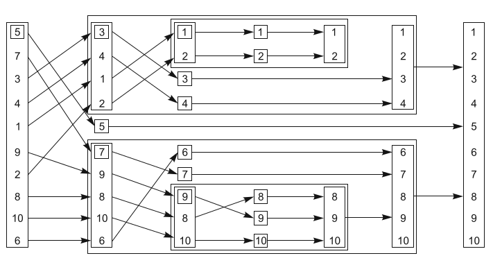
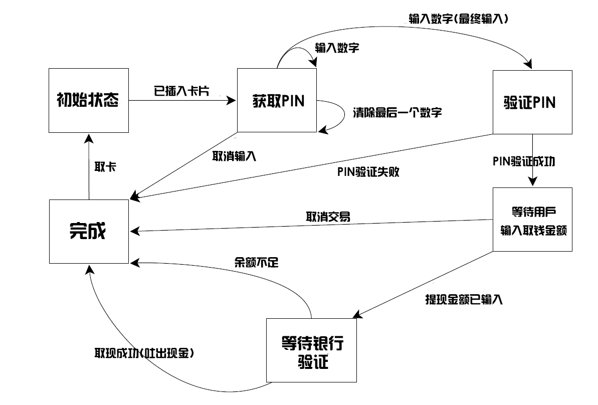

# 4.4 使用同步操作简化代码

同步工具的使用在本章称为构建块，你可以关注下那些需要同步的操作，而非使用具体的机制。当程序需要并发时，可提供更多的函数化的方法，帮助你简化代码。比起在多个线程间直接共享数据，每个任务拥有自己的数据会更好，并且结果可以使用期望值对其他线程进行广播。

### 4.4.1 使用期望值的函数化编程

术语*函数化编程*(functional programming)引用于一种编程方式，这种方式中的函数结果只依赖于传入函数的参数，并不依赖外部状态。当函数与数学概念相关时，使用相同的参数调用这个函数两次，两次的结果应该会完全相同。C++标准库中很多与数学相关的函数都有这个特性，例如，sin(正弦),cos(余弦)和sqrt(平方根)；当然，还有基本类型间的简单运算，例如，3+3，6*9，或1.3/4.7。纯粹的函数不会改变任何外部状态，并且这种特性完全限制了函数的返回值。

很容易想象这是种什么情况，特别是在并行发生时，因为在第3章我们讨论过，很多问题发生在共享数据上。当共享数据没有被修改，就不存在条件竞争，并且没有必要使用互斥量去保护共享数据。这是对编程极大的简化，例如Haskell语言[2]中函数默认就“纯粹的”；这种纯粹的方式，在并发编程中越来越受欢迎。因为大多数函数都是纯粹的，那么非纯粹的函数对共享数据的修改就显得更为突出，所以纯粹的函数很容易适应应用的整体结构。

函数化编程的好处，并不限于那些将“纯粹”作为默认方式(范型)的语言。C++是一个多范型的语言，也可以写出FP类型的程序。C++11的方式要比C++98简单许多，因为C++11支持Lambda表达式(详见附录A，A.6节)，还加入了[Boost](http://zh.wikipedia.org/wiki/Boost_C%2B%2B_Libraries)和[TR1](http://zh.wikipedia.org/wiki/C%2B%2B_Technical_Report_1)中的`std::bind`，以及自动可以自行推断类型的自动变量(详见附录A，A.7节)。期望值作为拼图的最后一块，它使得*函数化编程模式并发化*(FP-style concurrency)在C++中成为可能；期望值对象可以在线程间互相传递，并允许计算结果依赖于另外一个，而非对共享数据的显式访问。

**快速排序——FP模式版**

为了展示在*函数化*(PF)并发中使用期望值，让我们来看看一个简单的实现——快速排序算法。该算法的基本思想很简单：给定一个数据列表，然后选取其中一个数为“中间”值，之后将列表中的其他数值分成两组——一组比中间值大，另一组比中间值小。之后对小于“中间”值的组进行排序，并返回排序好的列表；再返回“中间”值；再对比“中间”值大的组进行排序，并返回排序的列表。图4.2中展示了10个整数在这种方式下进行排序的过程。



图4.2 FP-模式的递归排序

下面清单中的代码是FP-模式的顺序实现，需要传入列表，并且返回一个列表，与`std::sort()`做同样的事情不同。
(译者：`std::sort()`是无返回值的，因为参数接收的是迭代器，所以其可以对原始列表直进行修改与排序。可参考[sort()](http://www.cplusplus.com/reference/algorithm/sort/?kw=sort))

清单4.12 快速排序——顺序实现版

```c++
template<typename T>
std::list<T> sequential_quick_sort(std::list<T> input)
{
  if(input.empty())
  {
    return input;
  }
  std::list<T> result;
  result.splice(result.begin(),input,input.begin());  // 1
  T const& pivot=*result.begin();  // 2

  auto divide_point=std::partition(input.begin(),input.end(),
             [&](T const& t){return t<pivot;});  // 3

  std::list<T> lower_part;
  lower_part.splice(lower_part.end(),input,input.begin(),
             divide_point);  // 4
  auto new_lower(
             sequential_quick_sort(std::move(lower_part)));  // 5
  auto new_higher(
             sequential_quick_sort(std::move(input)));  // 6

  result.splice(result.end(),new_higher);  // 7
  result.splice(result.begin(),new_lower);  // 8
  return result;
}
```

虽然接口是FP模式的，但当使用FP模式时，需要做大量的拷贝操作，所以内部会使用“普通”的命令模式。选择第一个数为“中间”值，使用splice()①将输入的首个元素(中间值)放入结果列表中。虽然，这种方式产生的结果可能不是最优的(会有大量的比较和交换操作)，因为链表的访问方式是遍历，所以对`std::list`做任何事都需要花费较长的时间。这里清楚期望得到的结果，所以可以直接将“中间”值进行拼接。现在还需要使用“中间”值进行比较，所以使用了引用②，为的就是避免过多的拷贝。之后，可以使用`std::partition`将序列中的值分成小于“中间”值的组和大于“中间”值的组③。最简单的方法就是使用Lambda函数指定区分的标准，使用已获取的引用避免对“中间”值的拷贝(详见附录A，A.5节，更多有关Lambda函数的信息)。

`std::partition()`会对列表进行重置，并返回一个指向首元素(*不*小于“中间”值)的迭代器。迭代器的类型全称可能会很长，可以使用auto类型说明符，让编译器帮忙定义迭代器类型的变量(详见附录A，A.7节)。

现在，已经选择了FP模式的接口；所以，要使用递归对两部分排序，这需要创建两个列表。可以用splice()来做这件事，将input列表小于divided_point的值移动到新列表lower_part④中，其他数继续留在input列表中。而后，可以使用递归调用⑤⑥的方式，对两个列表进行排序。显式使用`std::move()`将列表传递到函数中，这还是为了避免大量的拷贝。最终，可以再次使用splice()，将result中的结果以正确的顺序进行拼接。new_higher指向的值放在“中间”值的后面⑦，new_lower指向的值放在“中间”值的前面⑧。

**快速排序——FP模式线程强化版**

函数化模式中，期望值很容易转化为并行版本，如下面的程序清单所示。其中的操作与前面相同，不同的是它们现在并行运行。

清单4.13 快速排序——期望值并行版

```c++
template<typename T>
std::list<T> parallel_quick_sort(std::list<T> input)
{
  if(input.empty())
  {
    return input;
  }
  std::list<T> result;
  result.splice(result.begin(),input,input.begin());
  T const& pivot=*result.begin();

  auto divide_point=std::partition(input.begin(),input.end(),
                [&](T const& t){return t<pivot;});
  
  std::list<T> lower_part;
  lower_part.splice(lower_part.end(),input,input.begin(),
                divide_point);

  std::future<std::list<T> > new_lower(  // 1
                std::async(&parallel_quick_sort<T>,std::move(lower_part)));

  auto new_higher(
                parallel_quick_sort(std::move(input)));  // 2

  result.splice(result.end(),new_higher);  // 3
  result.splice(result.begin(),new_lower.get());  // 4
  return result;
}
```

这里最大的变化是，当前线程不对小于“中间”值部分的列表进行排序，使用`std::async()`①在另一线程对其进行排序。大于部分列表，如同之前一样，使用递归的方式进行排序②。通过递归调用parallel_quick_sort()，就可以利用硬件并发了。`std::async()`会启动一个新线程，这样当递归三次时，就会有八个线程在运行了；当你递归十次(对于大约有1000个元素的列表)，如果硬件能处理这十次递归调用，将会创建1024个执行线程。当运行库认为这样做产生了太多的任务时(也许是因为数量超过了硬件并发的最大值)，运行库可能会同步的切换新产生的任务。当任务过多时(已影响性能)，为了避免任务想线程传递的开销，这些任务应该在使用get()函数获取结果的线程上运行，而不是在新线程上运行。值的注意的是这完全符合`std::async`的实现，为每一个任务启动一个线程(甚至是在任务超额时，也就是在`std::launch::deferred`没有明确规定的情况下)，或为了同步执行所有任务(在`std::launch::async`有明确规定的情况下)。当运行库的自动裁剪线程数量时，建议你去查看一下运行库的实现文档，了解一下将会有怎样的行为表现。

比起使用`std::async()`，这里可以写一个spawn_task()函数对`std::packaged_task`和`std::thread`做简单的包装，如清单4.14中的代码所示；需要为函数结果创建一个`std::packaged_task`对象， 并从这个对象中获取期望值，或在线程中执行它返回期望值。其本身并没有太多优势(事实上会造成大规模的超额任务)，但它可为转型成一个更复杂的实现铺平道路，实现将会向队列添加任务，而后使用线程池的方式来运行它们，第9章再来讨论线程池。使用`std::async`更适合于已知所有情况的任务，并且在线程池中构建或执行过任务的线程要能完全控制。

清单4.14 spawn_task的简单实现

```c++
template<typename F,typename A>
std::future<std::result_of<F(A&&)>::type>
   spawn_task(F&& f,A&& a)
{
  typedef std::result_of<F(A&&)>::type result_type;
  std::packaged_task<result_type(A&&)>
       task(std::move(f)));
  std::future<result_type> res(task.get_future());
  std::thread t(std::move(task),std::move(a));
  t.detach();
  return res;
}
```

其他先不管，回到parallel_quick_sort函数。因为只是直接递归去获取new_higher列表，就可以如之前一样对new_higher进行拼接③。但是，new_lower列表是`std::future<std::list<T>>`的实例，而非是一个简单的列表，所以需要调用get()成员函数在调用splice()④之前去检索数值。之后，等待后台任务完成，并且将结果移入splice()调用中；get()返回一个包含结果的右值引用，这样结果就是可以移动的(详见附录A，A.1.1节，有更多有关右值引用和移动语义的信息)。

假设使用`std::async()`是对可用硬件并发最好的选择，但这样的并行实现对于快速排序来说，依然不是最理想的。其中，`std::partition`做了很多工作，即使做了依旧是顺序调用，但就现在的情况而言，已经足够好了。如果对实现最快并行感兴趣的话，可以去查阅一些学术文献。或者，可以选择C++17中的并行重载版本(详见第10章)。

因避开了共享可变数据，函数化编程可算作是并发编程的范型，并且也是*通讯顺序进程*(CSP，Communicating Sequential Processer[3])的范型，这里的线程理论上是完全分开的，也就是没有共享数据，但是有通讯通道允许信息在不同线程间进行传递。这种范型被[Erlang语言](http://www.erlang.org)所采纳，并且在[MPI](http://www.mpi-forum.org)(*Message Passing Interface*，消息传递接口)上常用来做C和C++的高性能运算。现在应该不会在对学习它们而感到惊奇了吧，因为只需遵守一些约定，C++就能支持它们；在接下来的一节中，我们会讨论实现这种方式。

### 4.4.2 使用消息传递的同步操作

CSP的概念十分简单：当没有共享数据时，每个线程可以进行独立思考，其行为纯粹基于所接收到的信息。每个线程就都有自己的状态机：当线程收到一条信息，会以某种方式更新状态，并且可能向其他线程发出一条或多条信息，消息的处理机制依赖于线程的初始化状态。这是一种将其形式以有限状态机的模式实现，但是并不是唯一的方案；状态机可以在应用程序中隐式实现。这种方法在任何情况下，都更加依赖于明确的行为要求和编程团队的专业知识。无论选择用哪种方式去实现每个线程，任务都会有独立的处理部分，这样就能消除潜在的混乱(数据共享并发)，这就让编程变的更加简单，且降低错误率。

真正通讯顺序处理没有共享数据，所有消息都是通过消息队列传递，但C++线程共享一块地址空间，所以达不到真正通讯顺序处理的要求。这就需要一些约定来支持：作为应用或是库作者，我们有责任确保在实现中，线程不存在共享数据。当然，为了线程间的通信，消息队列必须共享，具体的细节要包含在库中。

试想有一天你要为实现ATM(自动取款机)写一个应用。这个应用需要处理：人们尝试取钱时和银行之间的交互情况，以及控制物理器械接受用户的卡片，显示适当的信息，处理按钮事件，吐出现金，还有退还用户的卡。

一种处理方法是让代码将所有事情分配到三个独立线程上去：一个线程去处理物理机械，一个去处理ATM机的逻辑，还有一个用来与银行通讯。这些线程可以通过信息进行纯粹的通讯，而不共享任何数据。比如，当有人在ATM机上插入了卡片或者按下按钮，处理物理机械的线程将会发送一条信息到逻辑线程上，并且逻辑线程将会发送一条消息到机械线程，告诉机械线程可以分配多少钱，等等。

一种为ATM机逻辑建模的方式，就是将其当做一个状态机。线程的每一个状态都会等待一条可接受的信息，这条信息包含需要处理的内容。这会让线程过渡到新的状态，并且继续循环。图4.3中将展示有状态参与的一个简单是实现。这个简化实现中，系统在等待一张卡插入。当有卡插入时，系统将会等待用户输入PIN(类似身份码的东西)，每次输入一个数字。用户可以将最后输入的数字删除。当数字输入完成，需要验证PIN。当验证有问题时，程序就需要终止，就需要为用户退出卡，并且继续等待其他人将卡插入到机器中；当验证通过时，程序要等待用户取消交易或选择取款。当用户选择取消交易，程序可以结束，并返还卡片。当用户选择取出一定量的现金，程序就要在吐出现金和返还卡片前等待银行方面的确认，或显示“余额不足”的信息，并返还卡片。很明显，一个真正的ATM机要考虑的东西更多、更复杂，但是对于我们来说，这样描述已经足够了。



图4.3 一台ATM机的状态机模型(简化)

我们已经为你的ATM机逻辑设计了一个状态机，可以使用一个类实现它，这个类中有一个成员函数可以代表每一个状态。每一个成员函数可以等待从指定集合中传入的信息，以及当它们到达时进行处理，这就有可能触发原始状态向另一个状态的转化。每种不同的信息类型由一个独立的struct表示。清单4.15展示了ATM逻辑部分的简单实现(以上描述的系统中，有主循环和对第一状态的实现)，并且一直在等待卡片插入。

如你所见，所有信息传递所需的的同步，完全包含在“信息传递”库中(基本实现在附录C中，是清单4.15代码的完整版)

清单4.15 ATM逻辑类的简单实现

```c++
struct card_inserted
{
  std::string account;
};

class atm
{
  messaging::receiver incoming;
  messaging::sender bank;
  messaging::sender interface_hardware;
  void (atm::*state)();

  std::string account;
  std::string pin;

  void waiting_for_card()  // 1
  {
    interface_hardware.send(display_enter_card());  // 2
    incoming.wait().  // 3
      handle<card_inserted>(
      [&](card_inserted const& msg)  // 4
      {
       account=msg.account;
       pin="";
       interface_hardware.send(display_enter_pin());
       state=&atm::getting_pin;
      }
    );
  }
  void getting_pin();
public:
  void run()  // 5
  {
    state=&atm::waiting_for_card;  // 6
    try
    {
      for(;;)
      {
        (this->*state)();  // 7
      }
    }
    catch(messaging::close_queue const&)
    {
    }
  }
};
```

之前提到的，这个实现对于实际ATM机的逻辑来说非常简单，但是能让你感受到信息传递编程的方式。这里无需考虑同步和并发问题，只需要考虑什么时候接收信息和发送信息即可。为ATM逻辑所设的状态机运行在独立的线程上，与系统的其他部分一起，比如：与银行通讯的接口，以及运行在独立线程上的终端接口。这种程序设计的方式被称为*参与者模式*([Actor model](http://zh.wikipedia.org/wiki/%E5%8F%83%E8%88%87%E8%80%85%E6%A8%A1%E5%BC%8F))——在系统中有很多独立的(运行在一个独立的线程上)参与者，这些参与者会互相发送信息，去执行手头上的任务，并且不会共享状态，除非是通过信息直接传入的。

运行从run()成员函数开始⑤，初始化waiting_for_card⑥的状态，然后反复执行当前状态的成员函数(无论这个状态时怎么样的)⑦。状态函数是简易atm类的成员函数。wait_for_card函数①依旧很简单：它发送一条信息到接口，让终端显示“等待卡片”的信息②，之后就等待传入一条消息进行处理③。处理的消息类型只能是card_inserted类的，这里使用一个Lambda函数④对其进行处理。当然，可以传递任何函数或函数对象去处理函数，但对于一个简单的例子来说，使用Lambda表达式是最简单的方式。注意，handle()函数调用与wait()函数进行连接的；当收到的信息类型与处理类型不匹配，收到的信息将会被丢弃，并且线程继续等待，直到接收到一条类型匹配的消息。

Lambda函数自身只是将用户的账号信息缓存到一个成员变量中去，并且清除PIN信息，再发送一条消息到硬件接口，让显示界面提示用户输入PIN，然后将线程状态改为“获取PIN”。当消息处理程序结束，状态函数就会返回，然后主循环会调用新的状态函数⑦。

如图4.3，getting_pin状态函数会负载一些，因为其要处理三个不同的信息类型。具体代码展示如下：

清单4.16 简单ATM实现中的getting_pin状态函数

```c++
void atm::getting_pin()
{
  incoming.wait()
    .handle<digit_pressed>(  // 1
      [&](digit_pressed const& msg)
      {
        unsigned const pin_length=4;
        pin+=msg.digit;
        if(pin.length()==pin_length)
        {
          bank.send(verify_pin(account,pin,incoming));
          state=&atm::verifying_pin;
        }
      }
      )
    .handle<clear_last_pressed>(  // 2
      [&](clear_last_pressed const& msg)
      {
        if(!pin.empty())
        {
          pin.resize(pin.length()-1);
        }
      }
      )
    .handle<cancel_pressed>(  // 3
      [&](cancel_pressed const& msg)
      {
        state=&atm::done_processing;
      }
      );
}
```

这次需要处理三种消息类型，所以wait()函数后面接了三个handle()函数调用①②③。每个handle()都有对应的消息类型作为模板参数，并且将消息传入一个Lambda函数中(其获取消息类型作为一个参数)。因为调用都被连接在了一起，wait()的实现知道它是等待一条digit_pressed消息，或是一条clear_last_pressed肖息，亦或是一条cancel_pressed消息，这样其他的消息类型将会被丢弃。

当获取一条消息时，无需再去改变状态。比如，当获取一条digit_pressed消息时，仅需要将其添加到pin中，除非那些数字是最终的输入。(清单4.15中)主循环⑦将会再次调用getting_pin()去等待下一个数字(或清除数字，或取消交易)。

这里对应的动作如图4.3所示，每个状态盒的实现都由一个不同的成员函数构成，等待相关信息并适当的更新状态。

一个并发系统中，这种编程方式可以极大的简化任务的设计，因为每一个线程都完全被独立对待。因此，使用多线程去分离关注点时，需要明确线程之间的任务应该如何分配。

### 4.4.3 并发技术规范中的持续性并发

并发技术规范在`std::experiment`命名空间中提供了新的`std::promise`和`std::packaged_taks`，其与`std`命名空间中类型完全不同：其返回实例类型为`std::experimental::future`，而不是`std::future`。这能让使用体会`std::experimental::future`所带来的新特性——持续性。

假设你的任务运行会产生一个结果，并且期望值持有这个结果。然后，你需要写一些代码来处理这个结果。使用`std::future`时，你必须等待期望值状态变为就绪态，要不就使用权阻塞成员函数wait()，或是使用wait_for()/wait_unitl()成员函数直到等待超时。这就会让代码变得非常复杂。你想要用一句话来说，就是“完事俱备，只等数据”。这也就是持续性添加的意义；为了给期望值添加持续性，只需要在成员函数后添加then()即可。比如：给定一个期望值fut，添加持续性的调用即为fut.then(continuation)。

与`std::future`类似 ,  `std::experimental::future`存储的值也只能检索一次。如果期望值正处于持续使用状态，那么这个期望值就不能被其他代码所访问。因此，当使用fut.then()为fut期望值添加持续性后，对原始期望值fut的操作就是非法的。另外，调用fut.then()会返回一个新的期望值，这个新的期望值会持有持续调用的结果。具体如下代码所示：

```c++
std::experimental::future<int> find_the_answer;
auto fut=find_the_answer();
auto fut2=fut.then(find_the_question);
assert(!fut.valid());
assert(fut2.valid());
```

当原始期望值为就绪态，find_the_question持续性函数没有安排在指定的线程上运行。这就给予了具体的自由，函数可以在一个线程池或是在另一个线程管理库上运行。其实这是经过考虑的，就是在将持续性引入C++标准时，让实现者能给予其丰富的经验，更好的指定线程的选择，并为用户提供合适的机制来控制线程。

与直接调用`std::async`或`std::thread`不同，持续性函数不需要传入参数，因为运行库已经为其定义好了参数——会传入一个就绪态持续性期望值，这个期望值保存了持续性触发后的结果。假设find_the_answer返回类型为int，find_the_question函数根据之前的例子将会传入一个` std::experimental::future<int> `作为唯一参数：

```c++
std::string find_the_question(std::experimental::future<int> the_answer);
```

这样做的原因是，持续性的期望之中会持有一个具体值或是一个异常。如果期望被隐式的解引用，将其值直接传递给持续性函数，那么运行库将会具体决定如何处理这种异常；反之，将期望值传递给持续性函数，那么持续性函数降回来处理这个异常。举个简单的例子，也就是通过fut.get()获取期望值持有的值，并且在持续性函数外将异常重新抛出并传播。就如同将函数传入`std::async`一样，异常存在于持有持续性结果的期望值中，这样异常就会逃出函数，从而进行传播。

需要注意的是，并发技术规范中没有指定这种情况等价于`std::async`，但实现可以提供这一扩展。这种函数写起来也很简单：使用`std::experimental::promise`来获取一个期望值，并且生成一个新的线程运行Lambda表达式，该Lambda表达式为承诺值设置给定函数的返回值，代码如下所示。

清单4.17 使用并发技术规范中的特性，实现与`std::async`等价的功能

```c++
template<typename Func>
std::experimental::future<decltype(std::declval<Func>()())>
spawn_async(Func&& func){
  std::experimental::promise<
    decltype(std::declval<Func>()())> p;
  auto res=p.get_future();
  std::thread t(
    [p=std::move(p),f=std::decay_t<Func>(func)]()
      mutable{
      try{
        p.set_value_at_thread_exit(f());
      } catch(...){
        p.set_exception_at_thread_exit(std::current_exception());
      }
  });
  t.detach();
  return res;
}
```

和`std::aync`一样，这里将函数的结果存储在期望值中，或捕获函数抛出的异常，将异常存到期望值中。同样的，这里为了保证在期望值达到就绪态时，thread_local变量已经使用set_value_at_thread_exit和set_exception_at_thread_exit清理过了。

值是从一个then()调用中返回，其返回的期望值是一个完整的期望值。这也就以为着，你可以对持续性进行连接。

### 4.4.4 持续性连接

假设你有一些列耗费时间的任务要完成，并且你想要使用多线程的方式异步完成这些任务，从而对减轻主线程上的计算压力。例如：当有用户登录了你的应用，你需要将登录凭证发送给后台；然后，对身份信息进行验证后，进一步从后台索取用户的账户信息；最后，当索引到相关信息后，使用获取到的信息对显示进行更新。串行执行的话，可以写成如下的方式：

清单4.18 处理用户登录——串行函数

```c++
void process_login(std::string const& username, std::string const& password)
{
  try{
    user_id const id = backend.authenticate_user(username, password);
    user_data const info_to_display = backend.request_current_info(id);
    update_display(info_to_display);
  } catch(std::exception& e){
    display_error(e);
  }
}
```

不过，你不想要串行代码吧；你想要的是一段异步代码，所以不想阻塞UI线程。使用`std::async`可以将另一个列表全部放在后台线程上，不过这依旧会阻塞UI线程，在等待这些任务完成的同时，会消耗大量的资源。如果你有很多这样的任务，那么可以结束一些那些只在等待的线程，从而节省资源。

清单4.19 处理用户登录——异步方式

```c++
std::future<void> process_login(
  std::string const& username, std::string const& password)
{
  return std::async(std::launch::async,[=](){
    try{
      user_id consst id = backend.authenticate_user(username, password);
      user_data const info_to_display = 
        backend.request_current_info(id);
      update_display(info_to_display);
    } catch(std::exception& e){
      display_error(e);
    }      
  });
}
```

为了避免阻塞相应线程，需要有机制对每个完成的任务进行连接：持续性。下面的代码清单展示的处理过程总体相同，但这次将整个任务分成了一系列任务，并且每个任务在完成的时候回连接到前一个任务上。

清单4.20 处理用户登录——持续性方式

```c++
std::experimental::future<void> process_login(
  std::string const& username, std::string const& password)
{
  return spawn_async([=](){
    return backend.authenticate_user(username, password);  
  }).then([](std::experimental::future<user_id> id){
    return backend.request_current_info(id.get());
  }).then([](std::experimental::future<user_data> info_to_display){
    try{
      update_display(info_to_display.get());
    } catch(std::exception& e){
      display_error(e);
    }
  });
}
```

需要注意的是每个持续性函数都有一个`std::experimental::future`作为独立参数，然后使用`.get()`来获取其拥有的值。这意味着异常会沿着这个链条进行传播，如果有函数抛出异常，那么就会在调用info_to_display.get()时抛出，这里的捕获结构可以处理所有的异常类型，就想清单4.18的catch那样。

因为需要等待消息通过网络或数据操作进行传输，所函数内部会对后端模块进行调用，但这时前端的任务还没有完成。可能已经将任务进行分割成独立的小任务，但它们仍然会阻塞调用，这样就会阻塞线程的运行，这里需要在后端任务完成时，前端处理就已经将结果处理好，而不是对线程进行阻塞。这样的话， backend.async_authenticate_user(username,password)返回` std::experimental::future<user_id> `会比返回user_id更加合适。

你可能觉得这段代码比较复杂，因为从持续函数返回的期望值类型为`future<future<some_value>>`，否则你只能将调用`.then`的语句放置在持续函数中。如果你这么想，你就错了，因为持续性支持一种极为精妙的特性，叫做*期望值展开*(future-unwrapping)。当你向`.then()`传递了持续性函数，并且返回一个future<some_type>类型的值，相应的`.then()`的返回值类型也是future<some_type>。最终的代码可能如下清单所示，这样在异步函数链上就不会存在阻塞了。

清单4.21  处理用户登录——全异步操作

```c++
std::experimental::future<void> process_login(
  std::string const& username, std::string const& password)
{
  return backend.async_authenticate_user(username, password).then(
    [](std::experimental::future<user_id> id){
      return backend.async_request_current_info(id.get());      
    }).then([](std::experimental::future<user_data> info_to_display){
      try{
        update_display(info_to_display.get());  
      } catch(std::exception& e){
        display_error(e);
      }
    });
}
```

这和清单4.18的代码几乎一模一样，区别就是Lambda表达式和将相应的功能包裹在`.then`的调用中。如果所用编译器支持C++14泛型Lambda表达式，那么Lambda表达式的参数列表中的类型可以使用auto替换，例如：

```c++
return backend.async_authenticate_user(username, password).then(
    [](auto id){
      return backend.async_request_current_info(id.get());
    });
```

如果需要比较简单的线性控制流来控制比较复杂的东西，可以使用Lambda表达式来实现一些逻辑功能；如果控制流是真的很复杂，那么就需要单独写一个函数来完成这件事了。

目前，我们一直讲注意力放在支持持续性的`std::experimental::future`上。`std::experimental::shared_future`同样支持持续性。二者的区别在于，`std::experimental::shared_future`对象可以具有多个持续性对象，不并且持续性参数是` std::experimental::shared_future`，而不是`std::experimental::future`。`std::experimental::shared_future`脱离了共享的本性——因为多个对象可以引用相同的共享状态，如果只允许一个延续，那么多个线程的情况下就会产生条件竞争，每个线程都试图将持续性对象添加到在自己的`std::experimental::shared_future`对象中。这种情况的确很糟糕，所以允许多持续性的存在。当使用多持续性时，可以通过同一个`std::experimental::shared_future`对象对其进行添加，而不用每个对象中只允许有一个持续性。另外，当你只打算给第二个持续性传递对象时，不能给第一个持续性的传递一个临时`std::experimental::shared_future`对象。因此，传递给延续性函数的参数也必须是`std::experimental::shared_future`对象。

```c++
auto fut = spawn_async(some_function).share();
auto fut2 = fut.then([](std::experimental::shared_future<some_data> data){
      do_stuff(data);
    });
auto fut3 = fut.then([](std::experimental::shared_future<some_data> data){
      return do_other_stuff(data);
    });
```

由于调用了`share()`，fut是一个`std::experimental::share_future`实例，这是因为持续性函数必须将`std::experimental::shared_future`对象作为参数。不过，持续性返回的值为`std::experimental::future`——目前这个值无法共享——所以fut2和fut3的类型都是`  std::experimental::future`。

在并发技术规范中，持续性只是增强期望值能力的一种方式而已，不过这种方式可能是最重要的。另外还提供了两个超载函数，并等待其中任意一个期望值状态为就绪，或是等待所有期望值状态为就绪。

### 4.4.5 等待多个期望值

假设你有很多的数据需要处理，并且每个数据都可以单独的进行处理。这是一个利用硬件的好机会，可以产生异步任务组来处理数据项，每个任务都通过期望值来返回处理过后的数据。不过，当你需要等待所有任务完成，才能得到最终的结果，对于逐个的对期望值进行收集，然后在整理结果，这总觉得不是很爽。如果打算用一个异步任务来收集结果，那么就先要生成这个异步任务，这样的话就会占用一个线程的资源，并且需要不断的对期望值进行轮询，当所有期望值状态为就绪时，生成新的任务。下面就展示了一个这样的例子：

清单4.22 使用`std::async`从多个期望值中收集结果

```c++
std::future<FinalResult> process_data(std::vector<MyData>& vec)
{
  size_t const chunk_size = whatever;
  std::vector<std::future<ChunkResult>> results;
  for (auto begin=vec.begin(), end=vec.end(); beg!=end;){
    size_t const remaining_size = end - begin;
    size_t const this_chunk_size = std::min(remaining_size, chunk_size);
    results.push_back(
      std::async(process_chunk, begin, begin+this_chunk_size));
    begin += this_chunk_size;
  }
  return std::async([all_results=std::move(results)](){
    std::vector<ChunkResult> v;
    v.reserve(all_results.size());
    for (auto& f : all_results)
    {
      v.push_back(f.get()); // 1      
    }
    return gather_results(v);
  });
}
```

这段代码会生成一个异步任务来等待处理结果，然后在所有处理结果都就绪的情况下，对结果进行整合。不过，每个任务都是独立的，因此当结果成为可用前，调度程序会在①处反复的进行唤醒，当发现有没有变为就绪态的结果时，再次回到休眠的状态。这样的方式不仅会占用线程资源，而且在之后对期望值的操作中会增加上下文切换频率，从而使应用增加了很多额外的开销。

可以使用` std::experimental::when_all`来避免这里的等待和切换。你可以将一组需要等待的期望值传入when_all函数中，其会返回一个新的期望值——当传入的所有期望值的状态都为就绪时，这个新的期望值状态就会被置为就绪。当所有期望值的状态都为就绪时，这个期望值可以和持续性配合起来一起处理其他的任务。下面的代码就展示了这样的一种方式：

清单4.23 使用` std::experimental::when_all`从多个期望值中收集结果

```c++
std::experimental::future<FinalResult> process_data(
  std::vector<MyData>& vec)
{
  size_t const chunk_size = whatever;
  std::vector<std::experimental::future<ChunkResult>> results;
  for (auto begin = vec.begin(), end = vec.end(); beg != end){
    size_t const remaining_size = end - begin;
    size_t const this_chunk_size = std::min(remaining_size, chunk_size);
    results.push_back(
      spawn_async(
        process_chunk, begin, begin+this_chunk_size));
    begin += this_chunk_size;
  }
  return std::experimental::when_all(
    results.begin(), results.end()).then( // 1
      [](std::future<std::vector<std::experimental::future<ChunkResult>>> ready_results){
        std::vector<std::experimental::future<ChunkResult>> all_results = ready_results.get();
        std::vector<ChunkResult> v;
        v.reserve(all_results.size());
        for (auto& f: all_results){
          v.push_back(f.get()); // 2
        }
        return gather_results(v);
      });
}
```

这个例子中，可以看到when_all函数会等待所有期望值的状态变为就绪，然后再用`.then`调用调度函数①，而不是使用async。虽然Lambda表达式表面上看上去是一样的，但这里讲results的vector作为参数(包装到期望值中)，而不是放在捕获器中，并在之后对每个期望值使用get②，从而无阻塞的获得所有处理后的结果。这不需要对代码做太多的修改，就能介绍系统的负担。

为了补全when_all，我们也有when_any。其也会产生一个期望值，当期望值组中任意一个期望为就绪态，那么这个新期望值的状态即为就绪。这对于并发性任务是一个不错的选择，不过就需要为第一个为就绪态的线程找点事情来做。

### 4.4.6 使用when_any等待第一个期望值

假设你在一大堆数据里面找一个符合要求的值，不过符合这样要求的值有很多，找到任何一个都可以。这种任务是可以并行的，可以多线程完成，每个任务去检查数据的一个子集；如果有线程找到了合适的值，那么这个线程会设置一个标志，让其他线程停止搜索，并返回结果。这种情况下，即使其他任务还没有完成清理，还是希望第一个完成搜索任务的线程对数据进行进一步的处理。

这就可以使用` std::experimental::when_any`将期望值收集在一起，并提供了一种新的特性，就是当期望值有一个为就绪态，这个任务即为完成。when_all会根据你传入的期望值集合给你返回一个新的期望值，when_any会添加额外的层，并将集合和索引值组合在一起，这里的索引用于表示触发就绪态的期望值，并将这个期望值添加到`std::experimental::when_any_result`类模板实例中。

清单中展示如何使用when_any。

清单4.24 使用` std::experimental::when_any `处理第一个被找到的值

```c++
std::experimental::future<FinalResult>
find_and_process_value(std::vector<MyData> &data)
{
  unsigned const concurrency = std::thread::hardware_concurrency();
  unsigned const num_tasks = (concurrency > 0)? concurrency : 2；
  std::vector<std::experimental::future<MyData *>> results;
  auto const chunk_size = (data.size() + num_tasks - 1) / num_tasks;
  auto chunk_begin = data.begin();
  std::shared_ptr<std::atomic<bool>> done_flag = 
      std::make_shared<std::atomic<bool>>(false);
  for (unsigned i = 0; i < num_tasks; ++i){ // 1
    auto chunk_end = 
      (i < (num_tasks - 1)? chunk_begin + chunk_size : data.end());
    results.push_back(spawn_async([=]{ // 2
      for (auto entry = chunk_begin;
           !*done_flag && (entry != chunk_end);
           ++entry){
        if (matches_find_criteria(*entry)){
          *done_flag = true;
          return &*entry;
        }
      }
      return (MyData *)nullptr;
    }));
    chunk_begin = chunk_end;
  }
  std::shared_ptr<std::experimental::promise<FinalResult>> final_result =
    std::make_shared<std::experimental::promise<FinalResult>>();
  struct DoneCheck {
    std::shared_ptr<std::experimental::promise<FinalResult>>
      final_result;
      
  DoneCheck(
    std::shared_ptr<std::experimental::promise<FinalResult>>
      final_result_)
    : final_result(std::move(final_result_)) {}
    
  void operator()( // 4
    std::experimental::future<std::experimental::when_any_result<
      std::vector<std::experimental::future<MyData *>>>>
        results_param) {
    auto results = results_param.get();
    MyData *const ready_result =
      results.futures[results.index].get(); // 5
    if (ready_result)
      final_result->set_value( // 6
        process_found_value(*ready_result));
    else {
      results.futures.erase(
        results.futures.begin() + results.index); // 7
      if (!results.futures.empty()) {
        std::experimental::when_any( // 8
          results.futures.begin(), results.futures.end())
          .then(std::move(*this));
      } else {
        final_result->set_exception(
          std::make_exception_ptr( // 9
            std::runtime_error(“Not found”)));
      }
    }
  };
  std::experimental::when_any(results.begin(), results.end())
  .then(DoneCheck(final_result)); // 3
  return final_result->get_future(); // 10
}
```

初始化循环①会产生num_tasks个异步任务，每个任务都是执行②处的Lambda表达式。这个Lambda表达式的捕获方式是拷贝，所以每个任务都有自己的chunk_begin和chunk_end，这里同样也拷贝了共享指针done_flag。这就避免了生命周期所带来的问题。

当所有任务都已经产生，希望对任务的返回结果进行处理。这可以调用when_any③通过连接持续性完成。这次可将持续性以类的方式去编写，因为你想要对其进行递归复用。当其中一个任务完成初始化，DoneCheck的函数操作符将会被调用④。首先，其已经准备好从就绪的期望值中获取值⑤，并且当符合条件的值被找到，你可以对其进行处理，并对最终结果进行设置⑥。 否则，就需要从集合中丢弃就绪的期望值⑦，当还有很多期望值需要检查时，会产生对when_any的再次调用⑧，要再触发器持续性，需要等待下个期望值到达就绪态。如果没有剩下任何其他期望值，那么就说明这个值没有找到，那么将会在期望值中存储一个异常⑨。函数的返回值是一个期望值，其包含有最终的结果⑩。当然，这个问题还有其他解法，不过我想在这里展示一下如何使用when_any。

这两个使用when_all和when_any的例子中，都使用了重载版的迭代器范围，其使用一堆迭代器来表示一组处于等待状态期望值的开始和末尾。这两个函数也可以以变量的形式出现，可以将一组期望值作为参数直接进行传入。这个例子中，期望值中存储的是一个元组(或when_any_result持有一个元组)，而不是一个vector：

```c++
std::experimental::future<int> f1=spawn_async(func1);
std::experimental::future<std::string> f2=spawn_async(func2);
std::experimental::future<double> f3=spawn_async(func3);
std::experimental::future<
  std::tuple<
    std::experimental::future<int>,
    std::experimental::future<std::string>,
    std::experimental::future<double>>> result=
  std::experimental::when_all(std::move(f1),std::move(f2),std::move(f3));
```

这个例子强调了when_any和when_all语法的重要性——他们可以通过容器中的任意`std::experimental::future`实例进行移动，并且通过值获取参数，因此需要显示将期望值传入，或是传递一个临时变量。

有时你所等待的事件是一组线程，或是要达到代码的特定点，或是它们配合着处理了一定量的数据。这种情况下，最好使用锁存器或栅栏机制，而不是期望值。现在，让我们来了解一下并发技术规范所提供的锁存器和栅栏机制。

### 4.4.7 并发技术规范中的锁存器和栅栏机制

首先，来思考一下，我们所说的锁存器或是栅栏机制是什么意思。锁存器，是一种同步对象，当它的计数器减为0时，它就准备就绪了。锁存器这个名称是基于其输出特性——当处于就绪态时，其就会保持就绪态，直到被销毁。因此，锁存器是为同步一系列事件发生的轻量级装置。

另外，栅栏机制是一种可重用的同步装置，其用于一组线程间的内部同步。虽然锁存器不在乎是哪个线程使得计数器递减——同一个线程可以对计数器递减多次，或多个线程对计数器递减一次，再或是其中有些线程对计数器有两次的递减——对于栅栏机制来说，每一个线程只能在每个周期到达栅栏一次。当线程都抵达栅栏时，会对线程进行阻塞，直到所有线程都达到栅栏处，这时阻塞将会被解除。栅栏可以复用——线程可以再次到达栅栏处，等待下一个周期的所有线程。

锁存器其实要比栅栏简单很多，所以我们就先从简单`std::experimental::latch`开始。

### 4.4.8 std::experimental::latch：基础的锁存器类型

` std::experimental::latch`声明在`<experimental/latch>`头文件中。在构造`std::experimental::latch`时，将计数器的值作为构造函数的唯一参数。之后，当等待的时间发生，就会调用锁存器count_down成员函数；当计数器为0时，锁存器状态变为就绪。可以调用wait成员函数对锁存器进行阻塞，直到等待的锁存器处于就绪状态时释放；如果需要对锁存器的是否就绪的状态进行检查，那么可以调用is_ready成员函数。想要减少计数器1并阻塞直至它抵达0，则可以调用count_down_and_wait成员函数。下面代码清单展示一个简单的例子：

清单4.25 使用` std::experimental::latch`等待所有事件

```c++
void foo(){
  unsigned const thread_count=...;
  latch done(thread_count); // 1
  my_data data[thread_count];
  std::vector<std::future<void> > threads;
  for(unsigned i=0;i<thread_count;++i)
    threads.push_back(std::async(std::launch::async,[&,i]{ // 2
      data[i]=make_data(i);
      done.count_down(); // 3
      do_more_stuff(); // 4
    }));
  done.wait(); // 5
  process_data(data,thread_count); // 6
} // 7
```

使用需要等待的时间数量对done的构造进行初始化①，并且使用`std::async`产生适量的线程②。在进行下一步之前④，每个线程生成了相应的数据块时，都会对锁存器的计数器进行递减③。在处理生成的数据⑥之前，主线程只需要等待锁存器成为就绪态即可⑤。⑥处的数据处理可能会与对线程的最终处理同步进行④——所以这里无法保证，在函数末尾`std::future`析构之前⑦，无法保证所有线程都已完成。

需要注意的是，在②传递给`std::async`Lambda表达式中，是通过引用的方式对除了i之外的所有内容进行捕获，而i是通过值捕获的方式进行传递。这是因为i是这里的循环计数器，如果通过引用捕获将会导致数据竞争和未定义的行为，而数据和完成状态是我们需要共享访问的东西。此外，在这种情况下，只需要一个锁存器就够了，因为线程在数据准备好之后，还有其他任务要做；否则，就需要在处理数据前，等待所有期望值，从确保所有任务都已经完成。

process_data中对data的访问时安全的⑥，即便这个值是有其他线程上的任务存储的，因为锁存器是一个同步对象，所以 线程调用cound_down改变计数器的行为是可见的，从而保证对wait的调用返回是在同一个锁存器对象上为可见。本质上，对count_down的调用与对wait的调用同步——在第5章中我们了解了底层内存需和同步约束之后，就会明白这意味着什么了。

除了锁存器之外，并发技术规范还未我们提供了用于同步一组线程的可复用的同步对象——栅栏机制。接下来就让我们一起来了解下这个机制。

### 4.4.9 std::experimental::barrier：简单的栅栏机制

### 4.4.10  std::experimental::flex_barrier—更灵活和友好版std::experimental::barrier
---------

[2] 详见 http://www.haskell.org/.

[3] 《通信顺序进程》(*Communicating Sequential Processes*), C.A.R. Hoare, Prentice Hall, 1985. 免费在线阅读地址 http://www.usingcsp.com/cspbook.pdf.