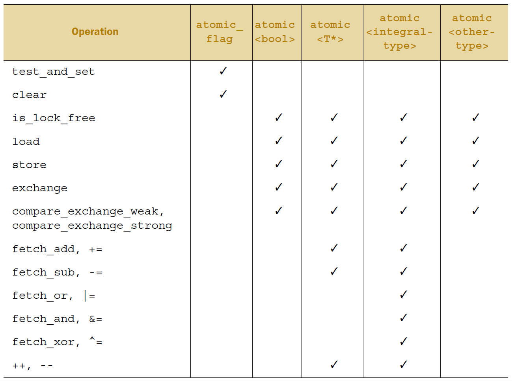

# 5.2 `C++`中的原子操作和原子类型

_原子操作_ 是个不可分割的操作。
在系统的所有线程中，你是不可能观察到原子操作完成了一半这种情况的；
它要么就是做了，要么就是没做，只有这两种可能。
如果从对象读取值的加载操作是 _原子_ 的，而且对这个对象的所有修改操作也是 _原子_ 的，
那么加载操作得到的值要么是对象的初始值，要么是某次修改操作存入的值。

另一方面，非原子操作可能会被另一个线程观察到只完成一半。
如果这个操作是一个存储操作，那么其他线程看到的值，可能既不是存储前的值，也不是存储的值，而是别的什么值。
如果这个非原子操作是一个加载操作，它可能先取到对象的一部分，然后值被另一个线程修改，然后它再取到剩余的部分，
所以它取到的既不是第一个值，也不是第二个值，而是两个值的某种组合。
正如第三章所讲的，这一下成了一个容易出问题的竞争冒险，
但在这个层面上它可能就构成了 _数据竞争_ （见5.1节），就成了未定义行为。

在`C++`中，多数时候你需要一个原子类型来得到原子的操作，我们来看一下这些类型。

## 5.2.1 标准原子类型

标准 _原子类型_ 定义在头文件`<atomic>`中。
这些类型上的所有操作都是原子的，在语言定义中只有这些类型的操作是原子的，不过你可以用互斥锁来 _模拟_ 原子操作。
实际上，标准原子类型自己的实现就可能是这样模拟出来的：
它们(几乎)都有一个`is_lock_free()`成员函数，
这个函数让用户可以查询某原子类型的操作是直接用的原子指令(`x.is_lock_free()`返回`true`)，
还是编译器和库内部用了一个锁(`x.is_lock_free()`返回`false`)。

只用`std::atomic_flag`类型不提供is_lock_free()成员函数。这个类型是一个简单的布尔标志，并且在这种类型上的操作都需要是无锁的；当你有一个简单无锁的布尔标志时，你可以使用其实现一个简单的锁，并且实现其他基础的原子类型。当你觉得“真的很简单”时，就说明：在`std::atomic_flag`对象明确初始化后，做查询和设置(使用test_and_set()成员函数)，或清除(使用clear()成员函数)都很容易。这就是：无赋值，无拷贝，没有测试和清除，没有其他任何操作。

剩下的原子类型都可以通过特化`std::atomic<>`类型模板而访问到，并且拥有更多的功能，但可能不都是无锁的(如之前解释的那样)。在最流行的平台上，期望原子变量都是无锁的内置类型(例如`std::atomic<int>`和`std::atomic<void*>`)，但这没有必要。你在后面将会看到，每个特化接口所反映出的类型特点；位操作(如&=)就没有为普通指针所定义，所以它也就不能为原子指针所定义。

除了直接使用`std::atomic<>`类型模板外，你可以使用在表5.1中所示的原子类型集。由于历史原因，原子类型已经添加入`C++`标准中，这些备选类型名可能参考相应的`std::atomic<>`特化类型，或是特化的基类。在同一程序中混合使用备选名与`std::atomic<>`特化类名，会使代码的移植大打折扣。

表5.1 标准原子类型的备选名和与其相关的`std::atomic<>`特化类

| 原子类型 | 相关特化类 |
| ------------ | -------------- |
| atomic_bool | std::atomic&lt;bool> |
| atomic_char | std::atomic&lt;char> |
| atomic_schar | std::atomic&lt;signed char> |
| atomic_uchar | std::atomic&lt;unsigned char> |
| atomic_int | std::atomic&lt;int> |
| atomic_uint | std::atomic&lt;unsigned> |
| atomic_short | std::atomic&lt;short> |
| atomic_ushort | std::atomic&lt;unsigned short> |
| atomic_long | std::atomic&lt;long> |
| atomic_ulong | std::atomic&lt;unsigned long> |
| atomic_llong | std::atomic&lt;long long> |
| atomic_ullong | std::atomic&lt;unsigned long long> |
| atomic_char16_t | std::atomic&lt;char16_t> |
| atomic_char32_t | std::atomic&lt;char32_t> |
| atomic_wchar_t | std::atomic&lt;wchar_t> |

C++标准库不仅提供基本原子类型，还定义了与原子类型对应的非原子类型，就如同标准库中的`std::size_t`。如表5.2所示这些类型:

表5.2 标准原子类型定义(typedefs)和对应的内置类型定义(typedefs)

| 原子类型定义 | 标准库中相关类型定义 |
| ------------ | -------------- |
| atomic_int_least8_t | int_least8_t |
| atomic_uint_least8_t | uint_least8_t |
| atomic_int_least16_t | int_least16_t |
| atomic_uint_least16_t | uint_least16_t |
| atomic_int_least32_t | int_least32_t |
| atomic_uint_least32_t | uint_least32_t |
| atomic_int_least64_t | int_least64_t |
| atomic_uint_least64_t | uint_least64_t |
| atomic_int_fast8_t | int_fast8_t |
| atomic_uint_fast8_t | uint_fast8_t |
| atomic_int_fast16_t | int_fast16_t |
| atomic_uint_fast16_t | uint_fast16_t |
| atomic_int_fast32_t | int_fast32_t |
| atomic_uint_fast32_t | uint_fast32_t |
| atomic_int_fast64_t | int_fast64_t |
| atomic_uint_fast64_t | uint_fast64_t |
| atomic_intptr_t | intptr_t |
| atomic_uintptr_t | uintptr_t |
| atomic_size_t | size_t |
| atomic_ptrdiff_t | ptrdiff_t |
| atomic_intmax_t | intmax_t |
| atomic_uintmax_t | uintmax_t |

好多种类型！不过，它们有一个相当简单的模式；对于标准类型进行typedef T，相关的原子类型就在原来的类型名前加上atomic_的前缀：atomic_T。除了singed类型的缩写是s，unsigned的缩写是u，和long long的缩写是llong之外，这种方式也同样适用于内置类型。对于`std::atomic<T>`模板，使用对应的T类型去特化模板的方式，要好于使用别名的方式。

通常，标准原子类型是不能拷贝和赋值，他们没有拷贝构造函数和拷贝赋值操作。但是，因为可以隐式转化成对应的内置类型，所以这些类型依旧支持赋值，可以使用load()和store()成员函数，exchange()、compare_exchange_weak()和compare_exchange_strong()。它们都支持复合赋值符：+=, -=, *=, |= 等等。并且使用整型和指针的特化类型还支持 ++ 和 --。当然，这些操作也有功能相同的成员函数所对应：fetch_add(), fetch_or() 等等。赋值操作和成员函数的返回值要么是被存储的值(赋值操作)，要么是操作前的值(命名函数)。这就能避免赋值操作符返回引用。为了获取存储在引用的的值，代码需要执行单独的读操作，从而允许另一个线程在赋值和读取进行的同时修改这个值，这也就为条件竞争打开了大门。

`std::atomic<>`类模板不仅仅一套特化的类型，其作为一个原发模板也可以使用用户定义类型创建对应的原子变量。因为，它是一个通用类模板，操作被限制为load(),store()(赋值和转换为用户类型), exchange(), compare_exchange_weak()和compare_exchange_strong()。

每种函数类型的操作都有一个可选内存排序参数，这个参数可以用来指定所需存储的顺序。在5.3节中，会对存储顺序选项进行详述。现在，只需要知道操作分为三类：

1. Store操作，可选如下顺序：memory_order_relaxed, memory_order_release, memory_order_seq_cst。<br>
2. Load操作，可选如下顺序：memory_order_relaxed, memory_order_consume, memory_order_acquire, memory_order_seq_cst。<br>
3. Read-modify-write(读-改-写)操作，可选如下顺序：memory_order_relaxed, memory_order_consume, memory_order_acquire, memory_order_release, memory_order_acq_rel, memory_order_seq_cst。<br>
所有操作的默认顺序都是memory_order_seq_cst。

现在，让我们来看一下每个标准原子类型进行的操作，就从`std::atomic_flag`开始吧。

## 5.2.2 std::atomic_flag的相关操作

`std::atomic_flag`是最简单的标准原子类型，它表示了一个布尔标志。这个类型的对象可以在两个状态间切换：设置和清除。它就是那么的简单，只作为一个构建块存在。我从未期待这个类型被使用，除非在十分特别的情况下。正因如此，它将作为讨论其他原子类型的起点，因为它会展示一些原子类型使用的通用策略。

`std::atomic_flag`类型的对象必须被ATOMIC_FLAG_INIT初始化。初始化标志位是“清除”状态。这里没得选择；这个标志总是初始化为“清除”：

```
std::atomic_flag f = ATOMIC_FLAG_INIT;
```

这适用于任何对象的声明，并且可在任意范围内。它是唯一需要以如此特殊的方式初始化的原子类型，但它也是唯一保证无锁的类型。如果`std::atomic_flag`是静态存储的，那么就的保证其是静态初始化的，也就意味着没有初始化顺序问题；在首次使用时，其都需要初始化。

当你的标志对象已初始化，那么你只能做三件事情：销毁，清除或设置(查询之前的值)。这些事情对应的函数分别是：clear()成员函数，和test_and_set()成员函数。clear()和test_and_set()成员函数可以指定好内存顺序。clear()是一个存储操作，所以不能有memory_order_acquire或memory_order_acq_rel语义，但是test_and_set()是一个“读-改-写”操作，所有可以应用于任何内存顺序标签。每一个原子操作，默认的内存顺序都是memory_order_seq_cst。例如：

```
f.clear(std::memory_order_release);  // 1
bool x=f.test_and_set();  // 2
```

这里，调用clear()①明确要求，使用释放语义清除标志，当调用test_and_set()②使用默认内存顺序设置表示，并且检索旧值。

你不能拷贝构造另一个`std::atomic_flag`对象；并且，你不能将一个对象赋予另一个`std::atomic_flag`对象。这并不是`std::atomic_flag`特有的，而是所有原子类型共有的。一个原子类型的所有操作都是原子的，因赋值和拷贝调用了两个对象，这就就破坏了操作的原子性。在这样的情况下，拷贝构造和拷贝赋值都会将第一个对象的值进行读取，然后再写入另外一个。对于两个独立的对象，这里就有两个独立的操作了，合并这两个操作必定是不原子的。因此，操作就不被允许。

有限的特性集使得`std::atomic_flag`非常适合于作自旋互斥锁。初始化标志是“清除”，并且互斥量处于解锁状态。为了锁上互斥量，循环运行test_and_set()直到旧值为false，就意味着这个线程已经被设置为true了。解锁互斥量是一件很简单的事情，将标志清除即可。实现如下面的程序清单所示：

清单5.1 使用`std::atomic_flag`实现自旋互斥锁

```
class spinlock_mutex
{
  std::atomic_flag flag;
public:
  spinlock_mutex():
    flag(ATOMIC_FLAG_INIT)
  {}
  void lock()
  {
    while(flag.test_and_set(std::memory_order_acquire));
  }
  void unlock()
  {
    flag.clear(std::memory_order_release);
  }
};
```

这样的互斥量是最最基本的，但是它已经足够`std::lock_guard<>`使用了(详见第3章)。其本质就是在lock()中等待，所以这里几乎不可能有竞争的存在，并且可以确保互斥。当我们看到内存顺序语义时，你将会看到它们是如何对一个互斥锁保证必要的强制顺序的。这个例子将在5.3.6节中展示。

由于`std::atomic_flag`局限性太强，因为它没有非修改查询操作，它甚至不能像普通的布尔标志那样使用。所以，你最好使用`std::atomic<bool>`，接下来让我们看看应该如何使用它。

## 5.2.3 std::atomic<bool>的相关操作

最基本的原子整型类型就是`std::atomic<bool>`。如你所料，它有着比`std::atomic_flag`更加齐全的布尔标志特性。虽然它依旧不能拷贝构造和拷贝赋值，但是你可以使用一个非原子的bool类型构造它，所以它可以被初始化为true或false，并且你也可以从一个非原子bool变量赋值给`std::atomic<bool>`的实例：

```
std::atomic<bool> b(true);
b=false;
```

另一件需要注意的事情时，非原子bool类型的赋值操作不同于通常的操作(转换成对应类型的引用，再赋给对应的对象)：它返回一个bool值来代替指定对象。这是在原子类型中，另一种常见的模式：赋值操作通过返回值(返回相关的非原子类型)完成，而非返回引用。如果一个原子变量的引用被返回了，任何依赖与这个赋值结果的代码都需要显式加载这个值，潜在的问题是，结果可能会被另外的线程所修改。通过使用返回非原子值进行赋值的方式，你可以避免这些多余的加载过程，并且得到的值就是实际存储的值。

虽然有内存顺序语义指定，但是使用store()去写入(true或false)还是好于`std::atomic_flag`中限制性很强的clear()。同样的，test_and_set()函数也可以被更加通用的exchange()成员函数所替换，exchange()成员函数允许你使用你新选的值替换已存储的值，并且自动的检索原始值。`std::atomic<bool>`也支持对值的普通(不可修改)查找，其会将对象隐式的转换为一个普通的bool值，或显示的调用load()来完成。如你预期，store()是一个存储操作，而load()是一个加载操作。exchange()是一个“读-改-写”操作：

```
std::atomic<bool> b;
bool x=b.load(std::memory_order_acquire);
b.store(true);
x=b.exchange(false, std::memory_order_acq_rel);
```

`std::atomic<bool>`提供的exchange()，不仅仅是一个“读-改-写”的操作；它还介绍了一种新的存储方式：当当前值与预期值一致时，存储新值的操作。

**存储一个新值(或旧值)取决于当前值**

这是一种新型操作，叫做“比较/交换”，它的形式表现为compare_exchange_weak()和compare_exchange_strong()成员函数。“比较/交换”操作是原子类型编程的基石；它比较原子变量的当前值和一个期望值，当两值相等时，存储提供值。当两值不等，期望值就会被更新为原子变量中的值。“比较/交换”函数值是一个bool变量，当返回true时执行存储操作，当false则更新期望值。

对于compare_exchange_weak()函数，当原始值与预期值一致时，存储也可能会不成功；在这个例子中变量的值不会发生改变，并且compare_exchange_weak()的返回是false。这可能发生在缺少单条CAS操作(“比较-交换”指令)的机器上，当处理器不能保证这个操作能够自动的完成——可能是因为线程的操作将指令队列从中间关闭，并且另一个线程安排的指令将会被操作系统所替换(这里线程数多于处理器数量)。这被称为“伪失败”(*spurious failure*)，因为造成这种情况的原因是时间，而不是变量值。

因为compare_exchange_weak()可以“伪失败”，所以这里通常使用一个循环：

```
bool expected=false;
extern atomic<bool> b; // 设置些什么
while(!b.compare_exchange_weak(expected,true) && !expected);
```

在这个例子中，循环中expected的值始终是false，表示compare_exchange_weak()会莫名的失败。

另一方面，如果实际值与期望值不符，compare_exchange_strong()就能保证值返回false。这就能消除对循环的需要，就可以知道是否成功的改变了一个变量，或已让另一个线程完成。

如果你想要改变变量值，且无论初始值是什么(可能是根据当前值更新了的值)，更新后的期望值将会变更有用；经历每次循环的时候，期望值都会重新加载，所以当没有其他线程同时修改期望时，循环中对compare_exchange_weak()或compare_exchange_strong()的调用都会在下一次(第二次)成功。如果值的计算很容易存储，那么使用compare_exchange_weak()能更好的避免一个双重循环的执行，即使compare_exchange_weak()可能会“伪失败”(因此compare_exchange_strong()包含一个循环)。另一方面，如果值计算的存储本身是耗时的，那么当期望值不变时，使用compare_exchange_strong()可以避免对值的重复计算。对于`std::atomic<bool>`这些都不重要——毕竟只可能有两种值——但是对于其他的原子类型就有较大的影响了。

 “比较/交换”函数很少对两个拥有内存顺序的参数进行操作，这就就允许内存顺序语义在成功和失败的例子中有所不同；其可能是对memory_order_acq_rel语义的一次成功调用，而对memory_order_relaxed语义的一次失败的调动。一次失败的“比较/交换”将不会进行存储，所以“比较/交换”操作不能拥有memeory_order_release或memory_order_acq_rel语义。因此，这里不保证提供的这些值能作为失败的顺序。你也不能提供比成功顺序更加严格的失败内存顺序；当你需要memory_order_acquire或memory_order_seq_cst作为失败语序，那必须要如同“指定它们是成功语序”那样去做。

如果你没有指定失败的语序，那就假设和成功的顺序是一样的，除了release部分的顺序：memory_order_release变成memory_order_relaxed，并且memoyr_order_acq_rel变成memory_order_acquire。如果你都不指定，他们默认顺序将为memory_order_seq_cst，这个顺序提供了对成功和失败的全排序。下面对compare_exchange_weak()的两次调用是等价的：

```
std::atomic<bool> b;
bool expected;
b.compare_exchange_weak(expected,true,
  memory_order_acq_rel,memory_order_acquire);
b.compare_exchange_weak(expected,true,memory_order_acq_rel);
```

我在5.3节中会详解对于不同内存顺序选择的结果。

`std::atomic<bool>`和`std::atomic_flag`的不同之处在于，`std::atomic<bool>`不是无锁的；为了保证操作的原子性，其实现中需要一个内置的互斥量。当处于特殊情况时，你可以使用is_lock_free()成员函数，去检查`std::atomic<bool>`上的操作是否无锁。这是另一个，除了`std::atomic_flag`之外，所有原子类型都拥有的特征。

第二简单的原子类型就是特化原子指针——`std::atomic<T*>`，接下来就看看它是如何工作的吧。

## 5.2.4 std::atomic<T*>:指针运算

原子指针类型，可以使用内置类型或自定义类型T，通过特化`std::atomic<T*>`进行定义，就如同使用bool类型定义`std::atomic<bool>`类型一样。虽然接口几乎一致，但是它的操作是对于相关的类型的指针，而非bool值本身。就像`std::atomic<bool>`，虽然它既不能拷贝构造，也不能拷贝赋值，但是他可以通过合适的类型指针进行构造和赋值。如同成员函数is_lock_free()一样，`std::atomic<T*>`也有load(), store(), exchange(), compare_exchange_weak()和compare_exchage_strong()成员函数，与`std::atomic<bool>`的语义相同，获取与返回的类型都是T*，而不是bool。

`std::atomic<T*>`为指针运算提供新的操作。基本操作有fetch_add()和fetch_sub()提供，它们在存储地址上做原子加法和减法，为+=, -=, ++和--提供简易的封装。对于内置类型的操作，如你所预期：如果x是`std::atomic<Foo*>`类型的数组的首地址，然后x+=3让其偏移到第四个元素的地址，并且返回一个普通的`Foo*`类型值，这个指针值是指向数组中第四个元素。fetch_add()和fetch_sub()的返回值略有不同(所以x.ftech_add(3)让x指向第四个元素，并且函数返回指向第一个元素的地址)。这种操作也被称为“交换-相加”，并且这是一个原子的“读-改-写”操作，如同exchange()和compare_exchange_weak()/compare_exchange_strong()一样。正像其他操作那样，返回值是一个普通的`T*`值，而非是`std::atomic<T*>`对象的引用，所以调用代码可以基于之前的值进行操作：

```
class Foo{};
Foo some_array[5];
std::atomic<Foo*> p(some_array);
Foo* x=p.fetch_add(2);  // p加2，并返回原始值
assert(x==some_array);
assert(p.load()==&some_array[2]);
x=(p-=1);  // p减1，并返回原始值
assert(x==&some_array[1]);
assert(p.load()==&some_array[1]);
```

函数也允许内存顺序语义作为给定函数的参数：

```
p.fetch_add(3,std::memory_order_release);
```

因为fetch_add()和fetch_sub()都是“读-改-写”操作，它们可以拥有任意的内存顺序标签，以及加入到一个释放序列中。指定的语序不可能是操作符的形式，因为没办法提供必要的信息：这些形式都具有memory_order_seq_cst语义。

剩下的原子类型基本上都差不多：它们都是整型原子类型，并且都拥有同样的接口(除了相关的内置类型不一样)。下面我们就看看这一类类型。

## 5.2.5 标准的原子整型的相关操作

如同普通的操作集合一样(load(), store(), exchange(), compare_exchange_weak(), 和compare_exchange_strong())，在`std::atomic<int>`和`std::atomic<unsigned long long>`也是有一套完整的操作可以供使用：fetch_add(), fetch_sub(), fetch_and(), fetch_or(), fetch_xor()，还有复合赋值方式((+=, -=, &=, |=和^=)，以及++和--(++x, x++, --x和x--)。虽然对于普通的整型来说，这些复合赋值方式还不完全，但也十分接近完整了：只有除法、乘法和移位操作不在其中。因为，整型原子值通常用来作计数器，或者是掩码，所以以上操作的缺失显得不是那么重要；如果需要，额外的操作可以将compare_exchange_weak()放入循环中完成。

对于`std::atomic<T*>`类型紧密相关的两个函数就是fetch_add()和fetch_sub()；函数原子化操作，并且返回旧值，而符合赋值运算会返回新值。前缀加减和后缀加减与普通用法一样：++x对变量进行自加，并且返回新值；而x++对变量自加，返回旧值。正如你预期的那样，在这两个例子中，结果都是相关整型的一个值。

我们已经看过所有基本原子类型；剩下的就是`std::atomic<>`类型模板，而非其特化类型。那么接下来让我们来了解一下`std::atomic<>`类型模板。

## 5.2.6 std::atomic<>主要类的模板

主模板的存在，在除了标准原子类型之外，允许用户使用自定义类型创建一个原子变量。不是任何自定义类型都可以使用`std::atomic<>`的：需要满足一定的标准才行。为了使用`std::atomic<UDT>`(UDT是用户定义类型)，这个类型必须有拷贝赋值运算符。这就意味着这个类型不能有任何虚函数或虚基类，以及必须使用编译器创建的拷贝赋值操作。不仅仅是这些，自定义类型中所有的基类和非静态数据成员也都需要支持拷贝赋值操作。这(基本上)就允许编译器使用memcpy()，或赋值操作的等价操作，因为它们的实现中没有用户代码。

最后，这个类型必须是“位可比的”(*bitwise equality comparable*)。这与对赋值的要求差不多；你不仅需要确定，一个UDT类型对象可以使用memcpy()进行拷贝，还要确定其对象可以使用memcmp()对位进行比较。之所以要求这么多，是为了保证“比较/交换”操作能正常的工作。

以上严格的限制都是依据第3章中的一个建议：不要将锁定区域内的数据，以引用或指针的形式，作为参数传递给用户提供的函数。通常情况下，编译器不会为`std::atomic<UDT>`类型生成无锁代码，所以它将对所有操作使用一个内部锁。如果用户提供的拷贝赋值或比较操作被允许，那么这就需要传递保护数据的引用作为一个参数，这就有悖于指导意见了。当原子操作需要时，运行库也可自由的使用单锁，并且运行库允许用户提供函数持有锁，这样就有可能产生死锁(或因为做一个比较操作，而阻塞了其他的线程)。最终，因为这些限制可以让编译器将用户定义的类型看作为一组原始字节，所以编译器可以对`std::atomic<UDT>`直接使用原子指令(因此实例化一个特殊无锁结构)。

注意，虽然使用`std::atomic<float>`或`std::atomic<double>`（内置浮点类型满足使用memcpy和memcmp的标准），但是它们在compare_exchange_strong函数中的表现可能会令人惊讶。当存储的值与当前值相等时，这个操作也可能失败，可能因为旧值是一个不同方式的表达。这就不是对浮点数的原子计算操作了。在使用compare_exchange_strong函数的过程中，你可能会遇到相同的结果，如果你使用`std::atomic<>`特化一个用户自定义类型，且这个类型定义了比较操作，而这个比较操作与memcmp又有不同——操作可能会失败，因为两个相等的值拥有不同的表达方式。

如果你的UDT类型的大小如同(或小于)一个int或`void*`类型时，大多数平台将会对`std::atomic<UDT>`使用原子指令。有些平台可能会对用户自定义类型(两倍于int或`void*`的大小)特化的`std::atmic<>`使用原子指令。这些平台通常支持所谓的“双字节比较和交换”([double-word-compare-and-swap](http://en.wikipedia.org/wiki/Double_compare-and-swap)，*DWCAS*)指令，这个指令与compare_exchange_xxx相关联着。这种指令的支持，对于写无锁代码是有很大的帮助，具体的内容会在第7章讨论。

以上的限制也意味着有些事情你不能做，比如，创建一个`std::atomic<std::vector<int>>`类型。这里不能使用包含有计数器，标志指针和简单数组的类型，作为特化类型。虽然这不会导致任何问题，但是，越是复杂的数据结构，就有越多的操作要去做，而非只有赋值和比较。如果这种情况发生了，你最好使用`std::mutex`保证数据能被必要的操作所保护，就像第3章描述的。

当使用用户定义类型T进行实例化时，`std::atomic<T>`的可用接口就只有: load(), store(), exchange(), compare_exchange_weak(), compare_exchange_strong()和赋值操作，以及向类型T转换的操作。表5.3列举了每一个原子类型所能使用的操作。



表5.3 每一个原子类型所能使用的操作

## 5.2.7 原子操作的释放函数

直到现在，我都还没有去描述成员函数对原子类型操作的形式。但是，在不同的原子类型中也有等价的非成员函数存在。大多数非成员函数的命名与对应成员函数有关，但是需要“atomic_”作为前缀(比如，`std::atomic_load()`)。这些函数都会被不同的原子类型所重载。在指定一个内存序列标签时，他们会分成两种：一种没有标签，另一种将“_explicit”作为后缀，并且需要一个额外的参数，或将内存顺序作为标签，亦或只有标签(例如，`std::atomic_store(&atomic_var,new_value)`与`std::atomic_store_explicit(&atomic_var,new_value,std::memory_order_release`)。不过，原子对象被成员函数隐式引用，所有释放函数都持有一个指向原子对象的指针(作为第一个参数)。

例如，`std::atomic_is_lock_free()`只有一种类型(虽然会被其他类型所重载)，并且对于同一个对象a，`std::atomic_is_lock_free(&a)`返回值与a.is_lock_free()相同。同样的，`std::atomic_load(&a)`和a.load()的作用一样，但需要注意的是，与a.load(std::memory_order_acquire)等价的操作是`std::atomic_load_explicit(&a, std::memory_order_acquire)`。

释放函数的设计是为了要与C语言兼容，在C中只能使用指针，而不能使用引用。例如，compare_exchange_weak()和compare_exchange_strong()成员函数的第一个参数(期望值)是一个引用，而`std::atomic_compare_exchange_weak()`(第一个参数是指向对象的指针)的第二个参数是一个指针。`std::atomic_compare_exchange_weak_explicit()`也需要指定成功和失败的内存序列，而“比较/交换”成员函数都有一个单内存序列形式(默认是`std::memory_order_seq_cst`)，重载函数可以分别获取成功和失败内存序列。

对`std::atomic_flag`的操作是“反潮流”的，在那些操作中它们“标志”的名称为：`std::atomic_flag_test_and_set()`和`std::atomic_flag_clear()`，但是以“_explicit”为后缀的额外操作也能够指定内存顺序：`std::atomic_flag_test_and_set_explicit()`和`std::atomic_flag_clear_explicit()`。

C++标准库也对在一个原子类型中的`std::shared_ptr<>`智能指针类型提供释放函数。这打破了“只有原子类型，才能提供原子操作”的原则，这里`std::shared_ptr<>`肯定不是原子类型。但是，C++标准委员会感觉对此提供额外的函数是很重要的。可使用的原子操作有：load, store, exchange和compare/exchange，这些操作重载了标准原子类型的操作，并且获取一个`std::shared_ptr<>*`作为第一个参数：

```
std::shared_ptr<my_data> p;
void process_global_data()
{
  std::shared_ptr<my_data> local=std::atomic_load(&p);
  process_data(local);
}
void update_global_data()
{
  std::shared_ptr<my_data> local(new my_data);
  std::atomic_store(&p,local);
}
```

作为和原子操作一同使用的其他类型，也提供“_explicit”变量，允许你指定所需的内存顺序，并且`std::atomic_is_lock_free()`函数可以用来确定实现是否使用锁，来保证原子性。

如之前的描述，标准原子类型不仅仅是为了避免数据竞争所造成的未定义操作，它们还允许用户对不同线程上的操作进行强制排序。这种强制排序是数据保护和同步操作的基础，例如，`std::mutex`和`std::future<>`。所以，让我继续了解本章的真实意义：内存模型在并发方面的细节，如何使用原子操作同步数据和强制排序。
