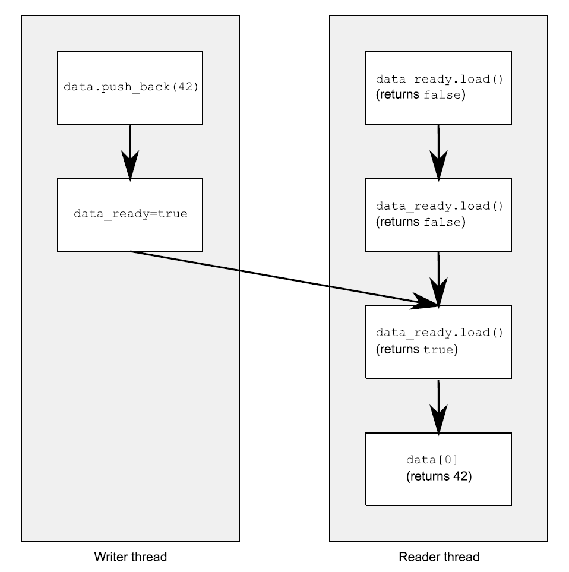
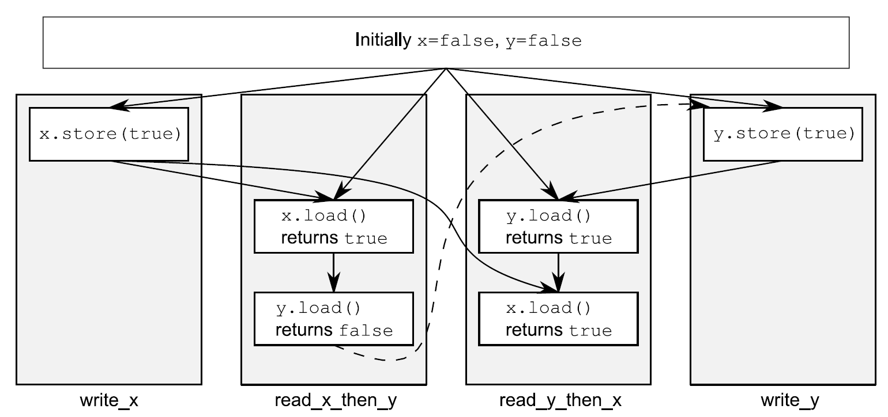
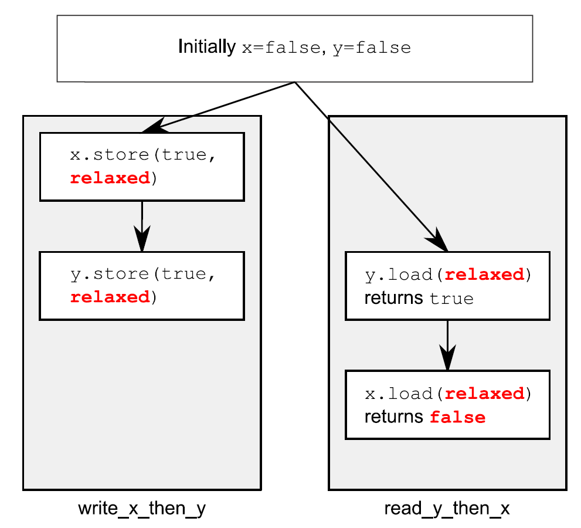
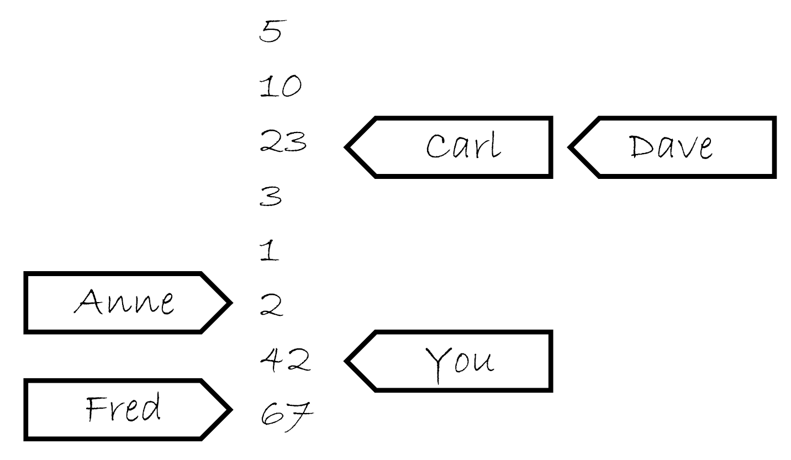
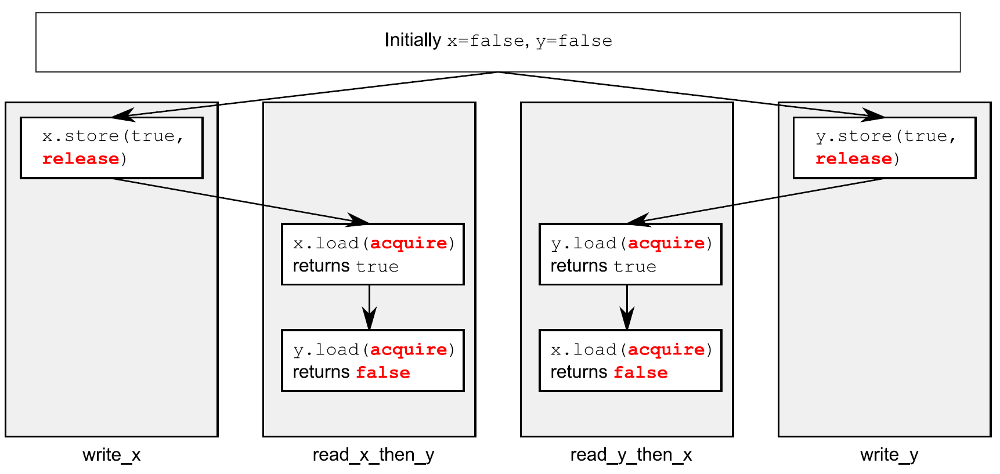
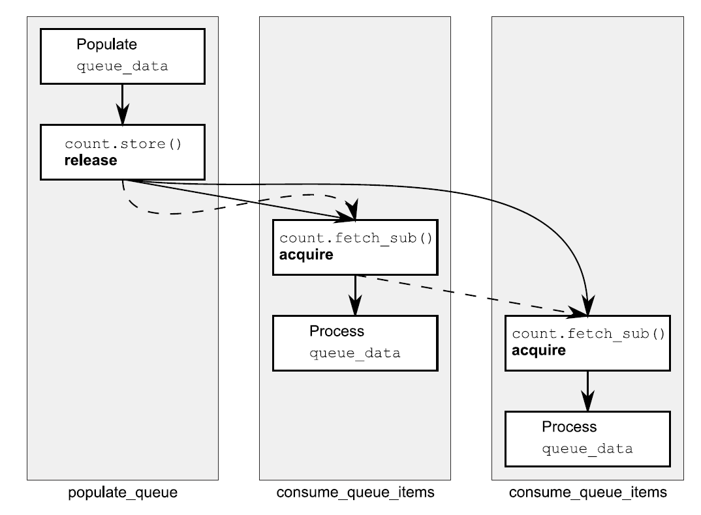

# 5.3 同步操作和强制排序

假设你有两个线程，一个向数据结构中填充数据，另一个读取数据结构中的数据。为了避免恶性条件竞争，第一个线程设置一个标志，用来表明数据已经准备就绪，并且第二个线程在这个标志设置前不能读取数据。下面的程序清单就是这样的情况。

清单5.2 不同线程对数据的读写

```
#include <vector>
#include <atomic>
#include <iostream>

std::vector<int> data;
std::atomic<bool> data_ready(false);

void reader_thread()
{
  while(!data_ready.load())  // 1
  {
    std::this_thread::sleep(std::milliseconds(1));
  }
  std::cout<<"The answer="<<data[0]<<"\m";  // 2
}
void writer_thread()
{
  data.push_back(42);  // 3
  data_ready=true;  // 4
}
```

先把等待数据的低效循环①放在一边（你需要这个循环，否则想要在线程间共享数据就是不切实际的：数据的每一项都必须是原子的）。你已经知道，当非原子读②和写③对同一数据结构进行无序访问时，将会导致未定义行为的发生，因此这个循环就是确保访问循序被严格的遵守的。

强制访问顺序是由对`std::atomic<bool>`类型的data_ready变量进行操作完成的；这些操作通过*[先行发生](http://en.wikipedia.org/wiki/Happened-before)*(happens-before)和*同步发生*(synchronizes-with)确定必要的顺序。写入数据③的操作，在写入data_ready标志④的操作前发生，并且读取标志①发生在读取数据②之前。当data_ready①为true，写操作就会与读操作同步，建立一个“先行发生”关系。因为“先行发生”是可传递的，所以写入数据③先行于写入标志④，这两个行为又先行于读取标志的操作①，之前的操作都先行于读取数据②，这样你就拥有了强制顺序：写入数据先行于读取数据，其他没问题了。图5.2展示了先行发生在两线程间的重要性。我向读者线程的while循环中添加了一对迭代。



图5.2 对非原子操作，使用原子操作对操作进行强制排序

所有事情看起来非常直观：对一个值来说，写操作必然先于读操作！在默认它们都是原子操作的时候，这无疑是正确的(这就是原子操作为默认属性的原因)，不过这里需要详细说明：原子操作对于排序要求，也有其他的选项，会在稍后进行详述。

现在，你已经了解了“先行发生”和“同步发生”操作，也是时候看看他们真正的意义了。我将从“同步发生”开始说起。

## 5.3.1 同步发生

“同步发生”只能在原子类型之间进行操作。例如对一个数据结构进行操作(对互斥量上锁)，如果数据结构包含有原子类型，并且操作内部执行了一定的原子操作，那么这些操作就是同步发生关系。从根本上说，这种关系只能来源于对原子类型的操作。

“同步发生”的基本想法是：在变量x进行适当标记的原子写操作W，同步与对x进行适当标记的原子读操作，读取的是W操作写入的内容；或是在W之后，同一线程上的原子写操作对x写入的值；亦或是任意线程对x的一系列原子读-改-写操作(例如，fetch_add()或compare_exchange_weak())。这里，第一个线程读取到的值是W操作写入的(详见5.3.4节)。

先将“适当的标记”放在一边，因为所有对原子类型的操作，默认都是适当标记的。这实际上就是：如果线程A存储了一个值，并且线程B读取了这个值，线程A的存储操作与线程B的载入操作就是同步发生的关系，如同清单5.2所示的那样。

我确信你假设过，所有细微的差别都在“适当的标记”中。`C++`内存模型允许为原子类型提供各种约束顺序，并且这个标记我们已经提过了。内存排序的各种选项和它们如何与同步发生的关系，将会在5.3.3节中讨论。

让我们先退一步，再来看一下“先行发生”关系。

## 5.3.2 先行发生

“先行发生”关系是一个程序中，基本构建块的操作顺序；它指定了某个操作去影响另一个操作。对于单线程来说，就简单了：当一个操作排在另一个之后，那么这个操作就是先行执行的。这意味着，如果源码中操作A发生在操作B之前，那么A就先行于B发生。你可以回看清单5.2：对data的写入③先于对data_ready④的写入。如果操作在同时发生，因为操作间无序执行，通常情况下，它们就没有先行关系了。这就是另一种排序未被指定的情况。下面的程序会输出“1，2”或“2，1”，因为两个get_num()的执行顺序未被指定。

清单5.3 对于参数中的函数调用顺序是未指定顺序的

```
#include <iostream>
void foo(int a,int b)
{
  std::cout<<a<<”,”<<b<<std::endl;
}
int get_num()
{
  static int i=0;
  return ++i;
}
int main()
{
  foo(get_num(),get_num());  // 无序调用get_num()
}
```

这种情况下，操作在单一声明中是可测序的，例如，逗号操作符的使用，或一个表达式的结果作为一个参数传给另一个表达式。但在通常情况下，操作在单一声明中是不可测序的，所以对其无法先行安排顺序(也就没有先行发生了)。当然，所有操作在一个声明中先行于在下一个声明中的操作。

这只是对之前单线程排序规则的重述，放在这里有什么新意吗？有新意的是线程间的互相作用：如果操作A在线程上，并且线程先行于另一线程上的操作B，那么A就先行于B。这也没什么：你只是添加了一个新关系(线程间的先行)，但当你正在编写多线程程序时，是就这是一个至关重要的关系了。

从基本层面上讲，线程间的先行比较简单，并且依赖与同步关系(详见5.3.1节):如果操作A在一个线程上，与另一个线程上的操作B同步，那么A就线程间先行于B。这同样是一个传递关系：如果A线程间先行于B，并且B线程间先行于C，那么A就线程间先行于C。你可以回看一下清单5.2。

线程间先行可以与排序先行关系相结合：如果操作A排序先行于操作B，并且操作B线程间先行于操作C，那么A线程间先行于C。同样的，如果A同步于B，并且B排序先于C，那么A线程间先行于C。两者的结合，意味着当你对数据进行一系列修改(单线程)时，为线程后续执行C，只需要对可见数据进行一次同步。

这些是线程间强制排序操作的关键规则，也是让清单5.2正常运行的因素。并在数据依赖上有一些细微的差别，你马上就会看到。为了让你理解这些差别，需要讲述一下原子操作使用的内存排序标签，以及这些标签和同步发生之间的联系。

## 5.3.3 原子操作的内存顺序

这里有六个内存序列选项可应用于对原子类型的操作：memory_order_relaxed, memory_order_consume, memory_order_acquire, memory_order_release, memory_order_acq_rel, 以及memory_order_seq_cst。除非你为特定的操作指定一个序列选项，要不内存序列选项对于所有原子类型默认都是memory_order_seq_cst。虽然有六个选项，但是它们仅代表三种内存模型：排序一致序列(*sequentially consistent*)，获取-释放序列(*memory_order_consume, memory_order_acquire, memory_order_release和memory_order_acq_rel*)，和自由序列(*memory_order_relaxed*)。

这些不同的内存序列模型，在不同的CPU架构下，功耗是不一样的。例如，基于处理器架构的可视化精细操作的系统，比起其他系统，添加的同步指令可被排序一致序列使用(在获取-释放序列和自由序列之前)，或被获取-释放序列调用(在自由序列之前)。如果这些系统有多个处理器，这些额外添加的同步指令可能会消耗大量的时间，从而降低系统整体的性能。另一方面，CPU使用的是x86或x86-64架构(例如，使用Intel或AMD处理器的台式电脑)，使用这种架构的CPU不需要任何对获取-释放序列添加额外的指令(没有保证原子性的必要了)，并且，即使是排序一致序列，对于加载操作也不需要任何特殊的处理，不过在进行存储时，有点额外的消耗。

不同种类的内存序列模型，允许专家利用其提升与更细粒度排序相关操作的性能。当默认使用排序一致序列(相较于其他序列，它是最简单的)时，对于在那些不大重要的情况下是有利的。

选择使用哪个模型，或为了了解与序列相关的代码，为什么选择不同的内存模型，是需要了解一个重要的前提，那就是不同模型是如何影响程序的行为。让我们来看一下选择每个操作序列和同步相关的结果。

**排序一致队列**

默认序列命名为排序一致，是因为程序中的行为从任意角度去看，序列顺序都保持一致。如果原子类型实例上的所有操作都是序列一致的，那么一个多线程程序的行为，就以某种特殊的排序执行，好像单线程那样。这是目前来看，最容易理解的内存序列，这也就是将其设置为默认的原因：所有线程都必须了解，不同的操作也遵守相同的顺序。因为其简单的行为，可以使用原子变量进行编写。通过不同的线程，你可以写出所有序列上可能的操作，这样就可以消除那些不一致，以及验证你代码的行为是否与预期相符。这也就意味着，所有操作都不能重排序；如果你的代码，在一个线程中，将一个操作放在另一个操作前面，那么这个顺序就必须让其他所有的线程所了解。

从同步的角度看，对于同一变量，排序一致的存储操作同步相关于同步一致的载入操作。这就提供了一种对两个(以上)线程操作的排序约束，但是排序一致的功能要比排序约束大的多。所以，对于使用排序一致原子操作的系统上的任一排序一致的原子操作，都会在对值进行存储以后，再进行加载。清单5.4就是这种一致性约束的演示。这种约束不是线程在自由内存序列中使用原子操作；这些线程依旧可以知道，操作以不同顺序排列，所以你必须使用排序一致操作，去保证在多线的情况下有加速的效果。

不过，简单是要付出代价的。在一个多核若排序的机器上，它会加强对性能的惩罚，因为整个序列中的操作都必须在多个处理器上保持一致，可能需要对处理器间的同步操作进行扩展(代价很昂贵！)。即便如此，一些处理器架构(比如通用x86和x86-64架构)就提供了相对廉价的序列一致，所以你需要考虑使用序列一致对性能的影响，这就需要你去查阅你目标处理器的架构文档，进行更多的了解。

以下清单展示了序列一致的行为，对于x和y的加载和存储都显示标注为memory_order_seq_cst，不过在这段代码中，标签可能会忽略，因为其是默认项。

清单5.4 全序——序列一致

```
#include <atomic>
#include <thread>
#include <assert.h>

std::atomic<bool> x,y;
std::atomic<int> z;

void write_x()
{
  x.store(true,std::memory_order_seq_cst);  // 1
}

void write_y()
{
  y.store(true,std::memory_order_seq_cst);  // 2
}
void read_x_then_y()
{
  while(!x.load(std::memory_order_seq_cst));
  if(y.load(std::memory_order_seq_cst))  // 3
    ++z;
}
void read_y_then_x()
{
  while(!y.load(std::memory_order_seq_cst));
  if(x.load(std::memory_order_seq_cst))  // 4
    ++z;
}
int main()
{
  x=false;
  y=false;
  z=0;
  std::thread a(write_x);
  std::thread b(write_y);
  std::thread c(read_x_then_y);
  std::thread d(read_y_then_x);
  a.join();
  b.join();
  c.join();
  d.join();
  assert(z.load()!=0);  // 5
}
```

assert⑤语句是永远不会触发的，因为不是存储x的操作①发生，就是存储y的操作②发生。如果在read_x_then_y中加载y③返回false，那是因为存储x的操作肯定发生在存储y的操作之前，那么在这种情况下在read_y_then_x中加载x④必定会返回true，因为while循环能保证在某一时刻y是true。因为memory_order_seq_cst的语义需要一个单全序将所有操作都标记为memory_order_seq_cst，这就暗示着“加载y并返回false③”与“存储y①”的操作，有一个确定的顺序。只有一个全序时，如果一个线程看到x==true，随后又看到y==false，这就意味着在总序列中存储x的操作发生在存储y的操作之前。

当然，因为所有事情都是对称的，所以就有可能以其他方式发生，比如，加载x④的操作返回false，或强制加载y③的操作返回true。在这两种情况下，z都等于1。当两个加载操作都返回true，z就等于2，所以任何情况下，z都不能是0。

当read_x_then_y知道x为true，并且y为false，那么这些操作就有“先发执行”关系了，如图5.3所示。



图5.3 序列一致与先发执行

虚线始于read_x_then_y中对y的加载操作，到达write_y中对y的存储，其暗示了排序关系需要保持序列一致：在操作的全局操作顺序memory_order_seq_cst中，加载操作必须在存储操作之前发生，就产生了图中的结果。

序列一致是最简单、直观的序列，但是他也是最昂贵的内存序列，因为它需要对所有线程进行全局同步。在一个多处理系统上，这就需要处理期间进行大量并且费时的信息交换。

为了避免这种同步消耗，你需要走出序列一致的世界，并且考虑使用其他内存序列。

**非排序一致内存模型**

当你踏出序列一致的世界，所有事情就开始变的复杂。可能最需要处理的问题就是：再也不会有全局的序列了。这就意味着不同线程看到相同操作，不一定有着相同的顺序，还有对于不同线程的操作，都会整齐的，一个接着另一个执行的想法是需要摒弃的。不仅是你有没有考虑事情真的同时发生的问题，还有线程没必要去保证一致性。为了写出(或仅是了解)任何一段使用非默认内存序列的代码，要想做这件事情，那么之前的那句话就是至关重要的。你要知道，这不仅仅是编译器可以重新排列指令的问题。即使线程运行相同的代码，它们都能拒绝遵循事件发生的顺序，因为操作在其他线程上没有明确的顺序限制；因为不同的CPU缓存和内部缓冲区，在同样的存储空间中可以存储不同的值。这非常重要，这里我再重申一遍：线程没必要去保证一致性。

不仅是要摒弃交错执行操作的想法，你还要放弃使用编译器或处理器重排指令的想法。在没有明确的顺序限制下，唯一的要求就是，所有线程都要统一对每一个独立变量的修改顺序。对不同变量的操作可以体现在不同线程的不同序列上，提供的值要与任意附加顺序限制保持一致。

踏出排序一致世界后，最好的示范就是使用memory_order_relaxed对所有操作进行约束。如果你已经对其有所了解，那么你可以跳到获取-释放序列继续阅读，获取-释放序列允许你选择在操作间引入顺序关系(并且收回你的理智)。

**自由序列**

在原子类型上的操作以自由序列执行，没有任何同步关系。在同一线程中对于同一变量的操作还是服从先发执行的关系，但是这里不同线程几乎不需要相对的顺序。唯一的要求是，在访问同一线程中的单个原子变量不能重排序；当一个给定线程已经看到一个原子变量的特定值，线程随后的读操作就不会去检索变量较早的那个值。当使用memory_order_relaxed，就不需要任何额外的同步，对于每个变量的修改顺序只是线程间共享的事情。

为了演示如何不去限制你的非限制操作，你只需要两个线程，就如同下面代码清单那样。

清单5.5 非限制操作只有非常少的顺序要求

```
#include <atomic>
#include <thread>
#include <assert.h>

std::atomic<bool> x,y;
std::atomic<int> z;

void write_x_then_y()
{
  x.store(true,std::memory_order_relaxed);  // 1
  y.store(true,std::memory_order_relaxed);  // 2
}
void read_y_then_x()
{
  while(!y.load(std::memory_order_relaxed));  // 3
  if(x.load(std::memory_order_relaxed))  // 4
    ++z;
}
int main()
{
  x=false;
  y=false;
  z=0;
  std::thread a(write_x_then_y);
  std::thread b(read_y_then_x);
  a.join();
  b.join();
  assert(z.load()!=0);  // 5
}
```

这次assert⑤可能会触发，因为加载x的操作④可能读取到false，即使加载y的操作③读取到true，并且存储x的操作①先发与存储y的操作②。x和y是两个不同的变量，所以这里没有顺序去保证每个操作产生相关值的可见性。

非限制操作对于不同变量可以自由重排序，只要它们服从任意的先发执行关系即可(比如，在同一线程中)。它们不会引入同步相关的顺序。清单5.5中的先发执行关系如图5.4所示(只是其中一个可能的结果)。尽管，在不同的存储/加载操作间有着先发执行关系，这里不是在一对存储于载入之间了，所以载入操作可以看到“违反”顺序的存储操作。



图5.4 非限制原子操作与先发执行

让我们来看一个略微复杂的例子，其有三个变量和五个线程。

清单5.6 非限制操作——多线程版

```
#include <thread>
#include <atomic>
#include <iostream>

std::atomic<int> x(0),y(0),z(0);  // 1
std::atomic<bool> go(false);  // 2

unsigned const loop_count=10;

struct read_values
{
  int x,y,z;
};

read_values values1[loop_count];
read_values values2[loop_count];
read_values values3[loop_count];
read_values values4[loop_count];
read_values values5[loop_count];

void increment(std::atomic<int>* var_to_inc,read_values* values)
{
  while(!go)
    std::this_thread::yield();  // 3 自旋，等待信号
  for(unsigned i=0;i<loop_count;++i)
  {
    values[i].x=x.load(std::memory_order_relaxed);
    values[i].y=y.load(std::memory_order_relaxed);
    values[i].z=z.load(std::memory_order_relaxed);
    var_to_inc->store(i+1,std::memory_order_relaxed);  // 4
    std::this_thread::yield();
  }
}

void read_vals(read_values* values)
{
  while(!go)
    std::this_thread::yield(); // 5 自旋，等待信号
  for(unsigned i=0;i<loop_count;++i)
  {
    values[i].x=x.load(std::memory_order_relaxed);
    values[i].y=y.load(std::memory_order_relaxed);
    values[i].z=z.load(std::memory_order_relaxed);
    std::this_thread::yield();
  }
}

void print(read_values* v)
{
  for(unsigned i=0;i<loop_count;++i)
  {
    if(i)
      std::cout<<",";
    std::cout<<"("<<v[i].x<<","<<v[i].y<<","<<v[i].z<<")";
  }
  std::cout<<std::endl;
}

int main()
{
  std::thread t1(increment,&x,values1);
  std::thread t2(increment,&y,values2);
  std::thread t3(increment,&z,values3);
  std::thread t4(read_vals,values4);
  std::thread t5(read_vals,values5);

  go=true;  // 6 开始执行主循环的信号

  t5.join();
  t4.join();
  t3.join();
  t2.join();
  t1.join();

  print(values1);  // 7 打印最终结果
  print(values2);
  print(values3);
  print(values4);
  print(values5);
}
```

这段代码本质上很简单。你拥有三个全局原子变量①和五个线程。每一个线程循环10次，使用memory_order_relaxed读取三个原子变量的值，并且将它们存储在一个数组上。其中三个线程每次通过循环④来更新其中一个原子变量，这时剩下的两个线程就只负责读取。当所有线程都“加入”，就能打印出来每个线程存到数组上的值了。

原子变量go②用来确保循环在同时退出。启动线程是昂贵的操作，并且没有明确的延迟，第一个线程可能在最后一个线程开始前结束。每个线程都在等待go变为true前都在进行循环③⑤，并且一旦go设置为true所有线程都会开始运行⑥。

程序一种可能的输出为：

```
(0,0,0),(1,0,0),(2,0,0),(3,0,0),(4,0,0),(5,7,0),(6,7,8),(7,9,8),(8,9,8),(9,9,10)
(0,0,0),(0,1,0),(0,2,0),(1,3,5),(8,4,5),(8,5,5),(8,6,6),(8,7,9),(10,8,9),(10,9,10)
(0,0,0),(0,0,1),(0,0,2),(0,0,3),(0,0,4),(0,0,5),(0,0,6),(0,0,7),(0,0,8),(0,0,9)
(1,3,0),(2,3,0),(2,4,1),(3,6,4),(3,9,5),(5,10,6),(5,10,8),(5,10,10),(9,10,10),(10,10,10)
(0,0,0),(0,0,0),(0,0,0),(6,3,7),(6,5,7),(7,7,7),(7,8,7),(8,8,7),(8,8,9),(8,8,9)
```

前三行中线程都做了更新，后两行线程只是做读取。每三个值都是一组x，y和z，并按照这样的顺序依次循环。对于输出，需要注意的一些事是：

1. 第一组值中x增1，第二组值中y增1，并且第三组中z增1。<br>
2. x元素只在给定集中增加，y和z也一样，但是增加是不均匀的，并且相对顺序在所有线程中都不同。<br>
3. 线程3看不到x或y的任何更新；他能看到的只有z的更新。这并不妨碍别的线程观察z的更新，并同时观察x和y的更新。<br>

对于非限制操作，这个结果是合法的，但是不是唯一合法的输出。任意组值都用三个变量保持一致，值从0到10依次递增，并且线程递增给定变量，所以打印出来的值在0到10的范围内都是合法的。

**了解自由排序**

为了了解自由序列是如何工作的，先将每一个变量想象成一个在独立房间中拿着记事本的人。他的记事本上是一组值的列表。你可以通过打电话的方式让他给你一个值，或让他写下一个新值。如果你告诉他写下一个新值，他会将这个新值写在表的最后。如果你让他给你一个值，他会从列表中读取一个值给你。

在你第一次与这个人交谈时，如果你问他要一个值，他可能会给你现在列表中的任意值。如果之后你再问他要一个值，它可能会再给你同一个值，或将列表后面的值给你，他不会给你列表上端的值。如果你让他写一个值，并且随后再问他要一个值，他要不就给你你刚告诉他的那个值，要不就是一个列表下端的值。

试想当他的笔记本上开始有5，10，23，3，1，2这几个数。如果你问他索要一个值，你可能获取这几个数中的任意一个。如果他给你10，那么下次再问他要值的时候可能会再给你10，或者10后面的数，但绝对不会是5。如果那你问他要了五次，他就可能回答“10，10，1，2，2”。如果你让他写下42，他将会把这个值添加在列表的最后。如果你再问他要值，他可能会告诉你“42”，直到有其他值写在了后面并且他认为他愿意将那个数告诉你。

现在，想象你有个朋友叫Carl，他也有那个计数员的电话。Carl也可以打电话给计算员，让他写下一个值或获取一个值，他对Carl回应的规则和你是一样的。他只有一部电话，所以他一次只能处理一个人的请求，所以他记事本上的列表是一个简单的列表。但是，你让他写下一个新值的时候，不意味着他会将这个消息告诉Carl，反之亦然。如果Carl从他那里获取一个值“23”，之后因为你告诉他写下42，这不意味着下次他会将这件事告诉Carl。他可能会告诉Carl任意一个值，23，3，1，2，42亦或是67(是Fred在你之后告诉他的)。他会很高兴的告诉Carl“23，3，3，1，67”，与你告诉他的值完全不一致。这就像它在使用便签跟踪告诉每个人的数，就像图5.5那样。



图5.5 计数员的笔记

现在，想象一下，不仅仅只有一个人在房间里，而是在一个小农场里，每个人都有一部电话和一个笔记本。这就是我们的原子变量。每一个变量拥有他们自己的修改顺序(笔记上的简单数值列表)，但是每个原子变量之间没有任何关系。如果每一个调用者(你，Carl，Anne，Dave和Fred)是一个线程，那么对每个操作使用memory_order_relaxed你就会得到上面的结果。这里还有些事情你可以告诉在小房子的人，例如，“写下这个值，并且告诉我现在列表中的最后一个值”(exchange)，或“写下这个值，当列表的最后一个值为某值；如果不是，告诉我看我是不是猜对了”(compare_exchange_strong)，但是这都不影响一般性原则。

如果你仔细想想清单5.5的逻辑，那么write_x_then_y就像某人打电话给房子x里的人，并且告诉他写下true，之后打电话给在y房间的另一个人，告诉他写下true。线程反复执行调用read_y_then_x，就像打电话给房间y的人问他要值，直到要到true，然后打电话给房间x的，继续问他要值。在x房间中的人有义务告诉你在他列表中任意指定的值，他也是有权利所false的。

这就让自由的原子操作变得难以处理。他们必须与原子操作结合使用，这些原子操作必须有较强的排序语义，为了让内部线程同步变得更有用。我强烈建议避免自由的原子操作，除非它们是硬性要求的，并且在使用它们的时候需要十二分的谨慎。给出的不直观的结果，就像是清单5.5中使用双线程和双变量的结果一样，不难想象在有更多线程和更多变量时，其会变的更加复杂。

要想获取额外的同步，且不使用全局排序一致，可以使用*获取-释放序列*(acquire-release ordering)。

**获取-释放序列**

这个序列是*自由序列*(relaxed ordering)的加强版；虽然操作依旧没有统一的顺序，但是在这个序列引入了同步。在这种序列模型中，原子加载就是*获取*(acquire)操作(memory_order_acquire)，原子存储就是*释放*(memory_order_release)操作，原子读-改-写操作(例如fetch_add()或exchange())在这里，不是“获取”，就是“释放”，或者两者兼有的操作(memory_order_acq_rel)。这里，同步在线程释放和获取间是*成对的*(pairwise)。释放操作与获取操作同步，这样就能读取已写入的值。这意味着不同线程看到的序列虽还是不同，但这些序列都是受限的。下面列表中是使用获取-释放序列(而非序列一致方式)，对清单5.4的一次重写。

清单5.7 获取-释放不意味着统一操作顺序

```
#include <atomic>
#include <thread>
#include <assert.h>

std::atomic<bool> x,y;
std::atomic<int> z;
void write_x()
{
  x.store(true,std::memory_order_release);
}
void write_y()
{
  y.store(true,std::memory_order_release);
}
void read_x_then_y()
{
  while(!x.load(std::memory_order_acquire));
  if(y.load(std::memory_order_acquire))  // 1
    ++z;
}
void read_y_then_x()
{
  while(!y.load(std::memory_order_acquire));
  if(x.load(std::memory_order_acquire))  // 2
    ++z;
}
int main()
{
  x=false;
  y=false;
  z=0;
  std::thread a(write_x);
  std::thread b(write_y);
  std::thread c(read_x_then_y);
  std::thread d(read_y_then_x);
  a.join();
  b.join();
  c.join();
  d.join();
  assert(z.load()!=0); // 3
}
```

在这个例子中断言③可能会触发(就如同自由排序那样)，因为可能在加载x②和y①的时候，读取到的是false。因为x和y是由不同线程写入，所以序列中的每一次释放到获取都不会影响到其他线程的操作。

图5.6展示了清单5.7的先行关系，对于读取的结果，两个(读取)线程看到的是两个完全不同的世界。如前所述，这可能是因为这里没有对先行顺序进行强制规定导致的。



图5.6 获取-释放，以及先行过程

为了了解获取-释放序列有什么优点，你需要考虑将两次存储由一个线程来完成，就像清单5.5那样。当你需要使用memory_order_release改变y中的存储，并且使用memory_order_acquire来加载y中的值，就像下面程序清单所做的那样，而后，就会影响到序列中对x的操作。

清单5.8 获取-释放操作会影响序列中的释放操作

```
#include <atomic>
#include <thread>
#include <assert.h>

std::atomic<bool> x,y;
std::atomic<int> z;

void write_x_then_y()
{
  x.store(true,std::memory_order_relaxed);  // 1 
  y.store(true,std::memory_order_release);  // 2
}
void read_y_then_x()
{
  while(!y.load(std::memory_order_acquire));  // 3 自旋，等待y被设置为true
  if(x.load(std::memory_order_relaxed))  // 4
    ++z;
}
int main()
{
  x=false;
  y=false;
  z=0;
  std::thread a(write_x_then_y);
  std::thread b(read_y_then_x);
  a.join();
  b.join();
  assert(z.load()!=0);  // 5
}
```

最后，读取y③时会得到true，和存储时写入的一样②。因为存储使用的是memory_order_release，读取使用的是memory_order_acquire，存储就与读取就同步了。因为这两个操作是由同一个线程完成的，所以存储x①先行于加载y②。对y的存储同步与对y的加载，存储x也就先行于对y的加载，并且扩展先行于x的读取。因此，加载x的值必为true，并且断言⑤不会触发。如果对于y的加载不是在while循环中，那么情况可能就会有所不同；加载y的时候可能会读取到false，在这种情况下对于读取到的x是什么值，就没有要求了。为了保证同步，加载和释放操作必须成对。所以，无论有何影响，释放操作存储的值，必须要让获取操作看到。当存储如②或加载如③，都是一个释放操作时，对x的访问就无序了，也就无法保证④处读到的是true，并且还会触发断言。

你也可以将获取-释放序列与之前提到记录员和他的小隔间相关联，不过你可能需要添加很多东西到这个模型中。首先，试想每个存储操作做一部分更新，那么当你电话给一个人，让他写下一个数字，你也需要告诉他更新哪一部分：“请在423组中写下99”。对于某一组的最后一个值的存储，你也需要告诉那个人：“请写下147，这是最后存储在423组的值”。小隔间中的人会即使写下这一信息，以及告诉他的值。这个就是存储-释放操作的模型。下一次，你告诉另外一个人写下一组值时，你需要改变组号：“请在组424中写入41”

当你询问一个时，你就要做出一个选择：你要不就仅仅询问一个值(这就是一次自由加载，这种情况下，小隔间中的人会给你的)，要不询问一个值以及其关于组的信息(是否是某组中的最后一个，这就是加载-获取模型)。当你询问组信息，且值不是组中的最后一个，隔间中的人会这样告诉你，“这个值是987，它是一个‘普通’值”，但当这个值是最后一个时，他会告诉你：“数字为987，这个值是956组的最后一个，来源于Anne”。现在，获取-释放的语义就很明确了：当你查询一个值，你告诉他你知道到所有组后，她会低头查看他的列表，看你知道的这些数，是不是在对应组的最后，并且告诉你那个值的属性，或继续在列表中查询。

如何理解这个模型中获取-释放的语义？让我们看一下我们的例子。首先，线程a运行write_x_then_y函数，然后告诉在x屋的记录员，“请写下true作为组1的一部分，信息来源于线程a”，之后记录员工整的写下了这些信息。而后，线程a告诉在y屋的记录员，“请写下true作为组1的一部分，信息来源于线程a”。在此期间，线程b运行read_y_then_x。线程b持续向y屋的记录员询问值与组的信息，直到它听到记录员说“true”。记录员可能不得不告诉他很多遍，不过最终记录员还是说了“true”。y屋的记录员不仅仅是说“true”，他还要说“组1最后是由线程a写入”。

现在，线程b会持续询问x屋的记录员，但这次他会说“请给我一个值，我知道这个值是组1的值，并且是由线程a写入的”。所以现在，x屋中的记录员就开始查找组1中由线程a写入的值。这里他注意到，他写入的值是true，同样也是他列表中的最后一个值，所以它必须读出这个值；否则，他讲打破这个游戏的规则。

当你回看5.3.2节中对“线程间先行”的定义，一个很重要的特性就是它的传递：当A线程间先行于B，并且B线程间先行于C，那么A就线程间先行于C。这就意味着，获取-释放序列可以在若干线程间使用同步数据，甚至可以在“中间”线程接触到这些数据前，使用这些数据。

**与同步传递相关的获取-释放序列**

为了考虑传递顺序，你至少需要三个线程。第一个线程用来修改共享变量，并且对其中一个做“存储-释放”处理。然后第二个线程使用“加载-获取”读取由“存储-释放”操作过的变量，并且再对第二个变量进行“存储-释放”操作。最后，由第三个线程通过“加载-获取”读取第二个共享变量。提供“加载-获取”操作，来读取被“存储-释放”操作写入的值，是为了保证同步关系，这里即便是中间线程没有对共享变量做任何操作，第三个线程也可以读取被第一个线程操作过的变量。下面的代码可以用来描述这样的场景。

清单5.9 使用获取和释放顺序进行同步传递

```
std::atomic<int> data[5];
std::atomic<bool> sync1(false),sync2(false);

void thread_1()
{
  data[0].store(42,std::memory_order_relaxed);
  data[1].store(97,std::memory_order_relaxed);
  data[2].store(17,std::memory_order_relaxed);
  data[3].store(-141,std::memory_order_relaxed);
  data[4].store(2003,std::memory_order_relaxed);
  sync1.store(true,std::memory_order_release);  // 1.设置sync1
}

void thread_2()
{
  while(!sync1.load(std::memory_order_acquire));  // 2.直到sync1设置后，循环结束
  sync2.store(true,std::memory_order_release);  // 3.设置sync2
}
void thread_3()
{
  while(!sync2.load(std::memory_order_acquire));   // 4.直到sync1设置后，循环结束
  assert(data[0].load(std::memory_order_relaxed)==42);
  assert(data[1].load(std::memory_order_relaxed)==97);
  assert(data[2].load(std::memory_order_relaxed)==17);
  assert(data[3].load(std::memory_order_relaxed)==-141);
  assert(data[4].load(std::memory_order_relaxed)==2003);
}
```

尽管thread_2只接触到变量syn1②和sync2③，不过这对于thread_1和thread_3的同步就足够了，这就能保证断言不会触发。首先，thread_1将数据存储到data中先行于存储sync1①（它们在同一个线程内）。因为加载sync1①的是一个while循环，它最终会看到thread_1存储的值(是从“释放-获取”对的后半对获取)。因此，对于sync1的存储先行于最终对于sync1的加载(在while循环中)。thread_3的加载操作④，位于存储sync2③操作的前面(也就是先行)。存储sync2③因此先行于thread_3的加载④，加载又先行于存储sync2③，存储sync2又先行于加载sync2④，加载syn2又先行于加载data。因此，thread_1存储数据到data的操作先行于thread_3中对data的加载，并且保证断言都不会触发。

在这个例子中，你可以将sync1和sync2，通过在thread_2中使用“读-改-写”操作(memory_order_acq_rel)，将其合并成一个独立的变量。其中会使用compare_exchange_strong()来保证thread_1对变量只进行一次更新：

```
std::atomic<int> sync(0);
void thread_1()
{
  // ...
  sync.store(1,std::memory_order_release);
}

void thread_2()
{
  int expected=1;
  while(!sync.compare_exchange_strong(expected,2,
              std::memory_order_acq_rel))
    expected=1;
}
void thread_3()
{
  while(sync.load(std::memory_order_acquire)<2);
  // ...
}
```

如果你使用“读-改-写”操作，选择语义就很重要了。在这个例子中，你想要同时进行获取和释放的语义，所以memory_order_acq_rel是一个合适的选择，但你也可以使用其他序列。使用memory_order_acquire语义的fetch_sub是不会和任何东西同步的，即使它存储了一个值，这是因为其没有释放操作。同样的，使用memory_order_release语义的fetch_or也不会和任何存储操作进行同步，因为对于fetch_or的读取，并不是一个获取操作。使用memory_order_acq_rel语义的“读-改-写”操作，每一个动作都包含获取和释放操作，所以可以和之前的存储操作进行同步，并且可以对随后的加载操作进行同步，就像上面例子中那样。

如果你将“获取-释放”操作和“序列一致”操作进行混合，“序列一致”的加载动作，就像使用了获取语义的加载操作；并且序列一致的存储操作，就如使用了释放语义的存储。“序列一致”的读-改-写操作行为，就像同时使用了获取和释放的操作。“自由操作”依旧那么自由，但其会和额外的同步进行绑定（也就是使用“获取-释放”的语义）。

尽管潜在的结果并不那么直观，每个使用锁的同学都不得不去解决同一个序列问题：锁住互斥量是一个获取操作，并且解锁这个互斥量是一个释放操作。随着互斥量的增多，你必须确保同一个互斥量在你读取变量或修改变量的时候是锁住的，并且同样适合于这里；你的获取和释放操作必须在同一个变量上，以保证访问顺序。当数据被一个互斥量所保护时，锁的性质就保证得到的结果是没有区别的，因为锁住与解锁的操作都是序列一致的操作。同样的，当你对原子变量使用获取和释放序列，为的是构建一个简单的锁，那么这里的代码必然要使用锁，即使内部操作不是序列一致的，其外部表现将会是序列一致的。

当你的原子操作不需要严格的序列一致序列，成对同步的“获取-释放”序列可以提供，比全局序列一致性操作，更加低廉的潜在同步。这里还需要对心理代价进行权衡，为了保证序列能够正常的工作，还要保证非直观的跨线程行为是没有问题的。

**获取-释放序列和memory_order_consume的数据相关性**

在介绍本章节的时候，我说过，memory_order_consume是“获取-释放”序列模型的一部分，但是在前面我们没有对其进行过多的讨论。这是因为memory_order_consume很特别：它完全依赖于数据，并且其展示了与线程间先行关系(可见5.3.2节)的不同之处。

这里有两种新关系用来处理数据依赖：*前序依赖*(dependency-ordered-before)和*携带依赖*(carries-a-dependency-to)。就像*前列*(sequenced-before)，携带依赖对于数据依赖的操作，严格应用于一个独立线程和其基本模型；如果A操作结果要使用操作B的操作数，而后A将携带依赖于B。如果A操作的结果是一个标量，比如int，而后的携带依赖关系仍然适用于，当A的结果存储在一个变量中，并且这个变量需要被其他操作使用。这个操作是也是可以传递的，所以当A携带依赖B，并且B携带依赖C，就额可以得出A携带依赖C的关系。

当其不影响线程间的先行关系时，对于同步来说，这并未带来任何的好处，但是它做到：当A前序依赖B，那么A线程间也前序依赖B。

这种内存序列的一个很重要使用方式，是在原子操作载入指向数据的指针时。当使用memory_order_consume作为加载语义，并且memory_order_release作为之前的存储语义，你要保证指针指向的值是已同步的，并且不需要对其他任何非独立数据施加任何同步要求。下面的代码就展示了这么一个场景。

清单5.10 使用`std::memroy_order_consume`同步数据

```
struct X
{
int i;
std::string s;
};

std::atomic<X*> p;
std::atomic<int> a;

void create_x()
{
  X* x=new X;
  x->i=42;
  x->s="hello";
  a.store(99,std::memory_order_relaxed);  // 1
  p.store(x,std::memory_order_release);  // 2
}

void use_x()
{
  X* x;
  while(!(x=p.load(std::memory_order_consume)))  // 3
    std::this_thread::sleep(std::chrono::microseconds(1));
  assert(x->i==42);  // 4
  assert(x->s=="hello");  // 5
  assert(a.load(std::memory_order_relaxed)==99);  // 6
}

int main()
{
  std::thread t1(create_x);
  std::thread t2(use_x);
  t1.join();
  t2.join();
}
```

尽管，对a的存储①在存储p②之前，并且存储p的操作标记为memory_order_release，加载p③的操作标记为memory_order_consume，这就意味着存储p仅先行那些需要加载p的操作。同样，也意味着X结构体中数据成员所在的断言语句④⑤不会被触发，这是因为对x变量操作的表达式对加载p的操作携带有依赖。另一方面，对于加载变量a⑥的断言就不能确定是否会被触发；这个操作并不依赖于p的加载操作，所以这里没法保证数据已经被读取。当然，这个情况也是很明显的，因为这个操作被标记为memory_order_relaxed。

有时，你不想为携带依赖增加其他的开销。你想让编译器在寄存器中缓存这些值，以及优化重排序操作代码，而不是对这些依赖大惊小怪。这种情况下，你可以使用`std::kill_dependecy()`来显式打破依赖链。`std::kill_dependency()`是一个简单的函数模板，其会复制提供的参数给返回值，但是依旧会打破依赖链。例如，当你拥有一个全局的只读数组，当其他线程对数组索引进行检索时，你使用的是`std::memory_order_consume`，那么你可以使用`std::kill_dependency()`让编译器知道这里不需要重新读取该数组的内容，就像下面的例子一样：

```
int global_data[]={ … };
std::atomic<int> index;

void f()
{
  int i=index.load(std::memory_order_consume);
  do_something_with(global_data[std::kill_dependency(i)]);
}
```

当然，你不需要在如此简单的场景下使用`std::memory_order_consume`，但是你可以在类似情况，且代码较为复杂时，调用`std::kill_dependency()`。你必须记住，这是为了优化，所以这种方式必须谨慎使用，并且需要性能数据证明其存在的意义。

现在，我们已经讨论了所有基本内存序列，是时候看看更加复杂的同步关系了————释放队列。

## 5.3.4 释放队列与同步

回到5.3.1节，我提到过，通过其他线程，即使有(有序的)多个“读-改-写”操作(所有操作都已经做了适当的标记)在存储和加载操作之间，你依旧可以获取原子变量存储与加载的同步关系。现在，我已经讨论所有可能使用到的内存序列“标签”，我在这里可以做一个简单的概述。当存储操作被标记为memory_order_release，memory_order_acq_rel或memory_order_seq_cst，加载被标记为memory_order_consum，memory_order_acquire或memory_order_sqy_cst，并且操作链上的每一加载操作都会读取之前操作写入的值，因此链上的操作构成了一个释放序列(*release sequence*)，并且初始化存储同步(对应memory_order_acquire或memory_order_seq_cst)或是前序依赖(对应memory_order_consume)的最终加载。操作链上的任何原子“读-改-写”操作可以拥有任意个存储序列(甚至是memory_order_relaxed)。

为了了解这些操作意味着什么，以及其重要性，考虑一个atomic<int>用作对一个共享队列的元素进行计数：

清单5.11 使用原子操作从队列中读取数据

```
#include <atomic>
#include <thread>

std::vector<int> queue_data;
std::atomic<int> count;

void populate_queue()
{
  unsigned const number_of_items=20;
  queue_data.clear();
  for(unsigned i=0;i<number_of_items;++i)
  {
    queue_data.push_back(i);
  }

  count.store(number_of_items,std::memory_order_release);  // 1 初始化存储
}

void consume_queue_items()
{
  while(true)
  {
    int item_index;
    if((item_index=count.fetch_sub(1,std::memory_order_acquire))<=0)  // 2 一个“读-改-写”操作
    {
      wait_for_more_items();  // 3 等待更多元素
      continue;
    }
    process(queue_data[item_index-1]);  // 4 安全读取queue_data
  }
}

int main()
{
  std::thread a(populate_queue);
  std::thread b(consume_queue_items);
  std::thread c(consume_queue_items);
  a.join();
  b.join();
  c.join();
}
```

一种处理方式是让线程产生数据，并存储到一个共享缓存中，而后调用count.store(number_of_items, memory_order_release)①让其他线程知道数据是可用的。线程群消耗着队列中的元素，之后可能调用count.fetch_sub(1, memory_order_acquire)②向队列索取一个元素，不过在这之前，需要对共享缓存进行完整的读取④。一旦count归零，那么队列中就没有更多的元素了，当元素耗尽时线程必须等待③。

当有一个消费者线程时还好，fetch_sub()是一个带有memory_order_acquire的读取操作，并且存储操作是带有memory_order_release语义，所以这里存储与加载同步，线程是可以从缓存中读取元素的。当有两个读取线程时，第二个fetch_sub()操作将看到被第一个线程修改的值，且没有值通过store写入其中。先不管释放序列的规则，这里第二个线程与第一个线程不存在先行关系，并且其对共享缓存中值的读取也不安全，除非第一个fetch_sub()是带有memory_order_release语义的，这个语义为两个消费者线程间建立了不必要的同步。无论是释放序列的规则，还是带有memory_order_release语义的fetch_sub操作，第二个消费者看到的是一个空的queue_data，无法从其获取任何数据，并且这里还会产生条件竞争。幸运的是，第一个fetch_sub()对释放顺序做了一些事情，所以store()能同步与第二个fetch_sub()操作。这里，两个消费者线程间不需要同步关系。这个过程在图5.7中展示，其中虚线表示的就是释放顺序，实线表示的是先行关系。



图5.7 清单5.11中对队列操作的释放顺序

操作链中可以有任意数量的链接，但是提供的都是“读-改-写”操作，比如fetch_sub()，store()，每一个都会与使用memory_order_acquire语义的操作进行同步。在这里例子中，所有链接都是一样的，并且都是获取操作，但它们可由不同内存序列语义组成的操作混合。(译者：也就是不是单纯的获取操作)

虽然，大多数同步关系，是对原子变量的操作应用了内存序列，但这里依旧有必要额外介绍一个对排序的约束——栅栏(*fences*)。

## 5.3.5 栅栏

如果原子操作库缺少了栅栏，那么这个库就是不完整的。栅栏操作会对内存序列进行约束，使其无法对任何数据进行修改，典型的做法是与使用memory_order_relaxed约束序的原子操作一起使用。栅栏属于全局操作，执行栅栏操作可以影响到在线程中的其他原子操作。因为这类操作就像画了一条任何代码都无法跨越的线一样，所以栅栏操作通常也被称为*内存栅栏*(memory barriers)。回忆一下5.3.3节，自由操作可以使用编译器或者硬件的方式，在独立的变量上自由的进行重新排序。不过，栅栏操作就会限制这种自由，并且会介绍之前没有介绍到的“先行”和“同步”关系。

我们给在不同线程上的两个原子操作中添加一个栅栏，代码如下所示：

清单5.12 栅栏可以让自由操作变的有序

```
#include <atomic>
#include <thread>
#include <assert.h>

std::atomic<bool> x,y;
std::atomic<int> z;

void write_x_then_y()
{
  x.store(true,std::memory_order_relaxed);  // 1
  std::atomic_thread_fence(std::memory_order_release);  // 2
  y.store(true,std::memory_order_relaxed);  // 3
}

void read_y_then_x()
{
  while(!y.load(std::memory_order_relaxed));  // 4
  std::atomic_thread_fence(std::memory_order_acquire);  // 5
  if(x.load(std::memory_order_relaxed))  // 6
    ++z;
}

int main()
{
  x=false;
  y=false;
  z=0;
  std::thread a(write_x_then_y);
  std::thread b(read_y_then_x);
  a.join();
  b.join();
  assert(z.load()!=0);  // 7
}
```

释放栅栏②与获取栅栏⑤同步，这是因为加载y的操作④读取的是在③处存储的值。所以，在①处存储x先行于⑥处加载x，最后x读取出来必为true，并且断言不会被触发⑦。原先不带栅栏的存储和加载x都是无序的，并且断言是可能会触发的。需要注意的是，这两个栅栏都是必要的：你需要在一个线程中进行释放，然后在另一个线程中进行获取，这样才能构建出同步关系。

在这个例子中，如果存储y的操作③标记为memory_order_release，而非memory_order_relaxed的话，释放栅栏②也会对这个操作产生影响。同样的，当加载y的操作④标记为memory_order_acquire时，获取栅栏⑤也会对之产生影响。使用栅栏的一般想法是：当一个获取操作能看到释放栅栏操作后的存储结果，那么这个栅栏就与获取操作同步；并且，当加载操作在获取栅栏操作前，看到一个释放操作的结果，那么这个释放操作同步于获取栅栏。当然，你也可以使用双边栅栏操作，举一个简单的例子，当一个加载操作在获取栅栏前，看到一个值有存储操作写入，且这个存储操作发生在释放栅栏后，那么释放栅栏与获取栅栏是同步的。

虽然，栅栏同步依赖于读取/写入的操作发生于栅栏之前/后，但是这里有一点很重要：同步点，就是栅栏本身。当你执行清单5.12中的write_x_then_y，并且在栅栏操作之后对x进行写入，就像下面的代码一样。这里，触发断言的条件就不保证一定为true了，尽管写入x的操作在写入y的操作之前发生。

```
void write_x_then_y()
{
  std::atomic_thread_fence(std::memory_order_release);
  x.store(true,std::memory_order_relaxed);
  y.store(true,std::memory_order_relaxed);
}
```

这里里的两个操作，就不会被栅栏分开，并且也不再有序。只有当栅栏出现在存储x和存储y操作之间，这个顺序是硬性的。当然，栅栏是否存在不会影响任何拥有先行关系的执行序列，这种情况是因为一些其他原子操作。

这个例子，以及本章中的其他例子，变量使用的都是完整的原子类型。不过，正真的好处在于，使用原子操作去执行一个序列，可以避免对于一些数据竞争的未定义行为，可以会看一下清单5.2。

## 5.3.6 原子操作对非原子的操作排序

当你使用一个普通的非原子bool类型来替换清单5.12中的x(就如同你下面看到的代码)，行为和替换前完全一样。

清单5.13 使用非原子操作执行序列

```
#include <atomic>
#include <thread>
#include <assert.h>

bool x=false;  // x现在是一个非原子变量
std::atomic<bool> y;
std::atomic<int> z;

void write_x_then_y()
{
  x=true;  // 1 在栅栏前存储x
  std::atomic_thread_fence(std::memory_order_release);
  y.store(true,std::memory_order_relaxed);  // 2 在栅栏后存储y
}

void read_y_then_x()
{
  while(!y.load(std::memory_order_relaxed));  // 3 在#2写入前，持续等待
  std::atomic_thread_fence(std::memory_order_acquire);
  if(x)  // 4 这里读取到的值，是#1中写入
    ++z;
}
int main()
{
  x=false;
  y=false;
  z=0;
  std::thread a(write_x_then_y);
  std::thread b(read_y_then_x);
  a.join();
  b.join();
  assert(z.load()!=0);  // 5 断言将不会触发
}
```

栅栏仍然为存储x①和存储y②，还有加载y③和加载x④提供一个执行序列，并且这里仍然有一个先行关系，在存储x和加载x之间，所以断言⑤不会被触发。②中的存储和③中对y的加载，都必须是原子操作；否则，将会在y上产生条件竞争，不过一旦读取线程看到存储到y的操作，栅栏将会对x执行有序的操作。这个执行顺序意味着，x上不存在条件竞争，即使它被另外的线程修改或被其他线程读取。

不仅是栅栏可对非原子操作排序。你在清单5.10中看到memory_order_release/memory_order_consume对，也可以用来排序非原子访问，为的是可以动态分配对象，并且本章中的许多例子都可以使用普通的非原子操作，去替代标记为memory_order_relaxed的操作。

对非原子操作的排序，可以通过使用原子操作进行，这里“前序”作为“先行”的一部分，就显得十分重要了。如果一个非原子操作是“序前”于一个原子操作，并且这个原子操作需要“先行”与另一个线程的一个操作，那么这个非原子操作也就“先行”于在另外线程的那个操作了。 这一序列操作，就是在清单5.13中对x的操作，并且这也就是清单5.2能工作的原因。对于C++标准库的高阶同步工具来说，这些都是基本，例如互斥量和条件变量。可以回看它们都是如何工作的，可以对清单5.1中简单的自旋锁展开更加深入的思考。

使用`std::memory_order_acquire`序列的lock()操作是在flag.test_and_set()上的一个循环，并且使用`std::memory_order_release`序列的unlock()调用flag.clear()。当第一个线程调用lock()时，标志最初是没有的，所以第一次调用test_and_set()将会设置标志，并且返回false，表示线程现在已锁，并且结束循环。之后，线程可以自由的修改由互斥量保护的数据。这时，任何想要调用lock()的线程，将会看到已设置的标志，而后会被test_and_set()中的循环所阻塞。

当线程带锁线程完成对保护数据的修改，它会调用unlock()，相当于调用带有`std::memory_order_release`语义的flag.clear()。这与随后其他线程访问flag.test_and_set()时调用lock()同步(见5.3.1节)，这是因为对lock()的调用带有`std::memory_order_acquire`语义。因为对于保护数据的修改，必须先于unlock()的调用，所以修改“先行”于unlock()，并且还“先行”于之后第二个线程对lock()的调用(因为同步关系是在unlock()和lock()中产生的)，还“先行”于当第二个线程获取锁后，对保护数据的任何访问。

虽然，其他互斥量的内部实现不尽相同，不过基本原理都是一样的:在某一内存位置上，lock()作为一个获取操作存在，在同样的位置上unlock()作为一个释放操作存在。
