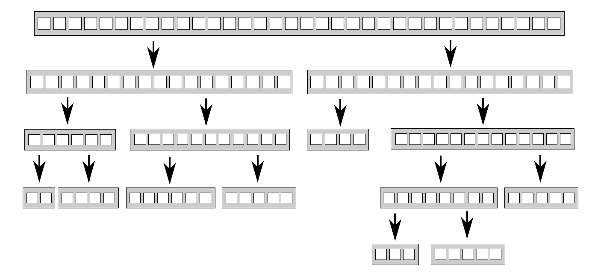

# 8.1 线程间划分工作的技术

试想被要求负责建造一座房子。为了完成任务，需要挖地基、砌墙、添加水暖、接入电线等等。理论上，如果你很擅长建造屋子，这些事情都可以由你来完成，但是这样就要花费很长很长时间，并且需要不断的切换任务。或者，你可以雇佣一些人来帮助你完成房子的建造。那么现在你需要决定雇多少人，以及雇佣人员具有什么样的技能。比如，你可以雇几个人，这几个人什么都会。现在你还得不断的切换任务，不过因为雇佣了很多人，就要比之前的速度快很多。

或者，你可以雇佣一个包工队(专家组)，由瓦工，木匠，电工和水管工组成。你的包工队员只做其擅长的，所以当没有水暖任务时，水管工会坐在那里休息，喝茶或咖啡。因为人多的缘故，要比之前一个人的速度快很多，并且水管工在收拾厕所的时候，电工可以将电线连接到厨房，不过当没有属于自己的任务时，有人就会休息。即使有人在休息，你可能还是能感觉到包工队要比雇佣一群什么都会的人快。包工队不需要更换工具，并且每个人的任务都要比会的人做的快。是快还是慢，取决于特定的情况——需要尝试，进行观察。

即使雇佣包工队，你依旧可以选择人数不同的团队(可能在一个团队中，瓦工的数量超过电工)。同样，这会是一种补足，并且在建造不止一座房子的时候，会改变整体效率。即使水管工没有太多的任务，在建造过一次房子后，你依旧能让他总是处于忙碌的状态。当包工队无事可做的时候，你是不会给他们钱的；即使每次工作只有那么几个人工作，你还需要负担整个团队的开销。

建造例子已经足够说明问题，这与线程所做的事情有什么关系呢？好吧，这些问题也会发生在线程上。需要决定使用多少个线程，并且这些线程应该去做什么。还需要决定是使用“全能”的线程去完成所有的任务，还是使用“专业”线程只去完成一件事情，或将两种方法混合。使用并发的时候，需要作出诸多选择来驱动并发，选择会决定代码的性能和清晰度。因此选择至关重要，所以设计应用结构时，需要作出适当的决定。本节中，将看到很多划分任务的技术，就先从线程间划分数据开始吧！

## 8.1.1 线程处理前对数据进行划分

最简单的并行算法，就是并行化的`std::for_each`，其会对一个数据集中每个元素执行同一个操作。为了并行化该算法，可为数据集中每个元素分配一个处理线程。如何划分才能获得最佳的性能，很大程度上取决于数据结构实现的细节，之后有关性能问题的章节会再提及此问题。

最简单的分配方式：第一组N个元素分配一个线程，下一组N个元素再分配一个线程，以此类推，如图8.1所示。不管数据怎么分，每个线程都会对分配给它的元素进行操作，不过并不会和其他线程进行沟通，直到处理完成。


图8.1 向线程分发连续的数据块

使用过*MPI*(Message Passing Interface)[1]和OpenMP[2]的同学对这个结构一定很熟悉：一项任务被分割成多个，放入一个并行任务集中，执行线程独立的执行这些任务，结果在会有主线程中合并。这种方式在2.4节中的accumulate的例子中使用过了；这个例子中，所有并行任务和主线程的任务都是累加和。对于for_each来说，主线程将无事可做，因为这个计算不需要最终处理。

最后一步对于并行程序来说十分重要；如清单2.8中那样原始的实现，最后一步就是串行的。不过，这一步同样也是能被并行化；accumulate实际上是一个递减操作，所以清单2.8中，当线程数量大于一个线程上最小处理项时，可以对accumulate进行递归调用。或者工作线程就像做一个完整的任务一样，对步骤进行递减，而非每次都产生新的线程。

虽然这个技术十分强大，但是并不是哪都适用。有时不能像之前那样，对任务进行整齐的划分，因为只有对数据进行处理后，才能进行明确的划分。这里特别适用了递归算法，就像快速排序；下面就来看看这种特别的方式。

## 8.1.2 递归划分

快速排序有两个最基本的步骤：将数据划分到中枢元素之前或之后，然后对中枢元素之前和之后的两半数组再次进行快速排序。这里不能通过对数据的简单划分达到并行，因为只有在一次排序结束后，才能知道哪些项在中枢元素之前和之后。当要对这种算法进行并行化，很自然的会想到使用递归。每一级的递归都会多次调用quick_sort函数，因为需要知道哪些元素在中枢元素之前和之后。递归调用是完全独立的，因为其访问的是不同的数据集，并且每次迭代都能并发执行。图8.2展示了这样的递归划分。



图 8.2 递归划分数据

第4章中已经见过这种实现，比起对大于和小于的数据块递归调用函数，使用`std::async()`可以为每一级生成小于数据块的异步任务。使用`std::async()`时，C++线程库就能决定何时让一个新线程执行任务，以及同步执行任务。

重要的是：对一个很大的数据集进行排序时，当每层递归都产生一个新线程，最后就会产生大量的线程。会看到大量线程对性能的影响，如果有太多的线程存在，那么应用将会运行的很慢。如果数据集过于庞大，会将线程耗尽。那么在递归的基础上进行任务的划分，就是一个不错的主意；只需要将一定数量的数据打包后，交给线程即可。`std::async()`可以处理这种简单的情况，不过这不是唯一的选择。

另一种选择是使用`std::thread::hardware_concurrency()`函数来确定线程的数量，就像在清单2.8中的并行版accumulate()一样。然后，可以将已排序的数据推到线程安全的栈上(如第6、7章中提及的栈)。线程无所事事时，不是已经完成对自己数据块的梳理，就是在等待一组排序数据的产生；线程可以从栈上获取这组数据，并且对其排序。

下面的代码就是使用以上方式进行的实现。与大多数示例一样，就是为了演示想法，而不是作为工业代码。如果使用C++ 17编译器，最好使用标准库提供的并行算法，这些会在第10章再来讨论。

清单8.1 使用栈的并行快速排序算法——等待数据块排序

```c++
template<typename T>
struct sorter  // 1
{
  struct chunk_to_sort
  {
    std::list<T> data;
    std::promise<std::list<T> > promise;
  };

  thread_safe_stack<chunk_to_sort> chunks;  // 2
  std::vector<std::thread> threads;  // 3
  unsigned const max_thread_count;
  std::atomic<bool> end_of_data;

  sorter():
    max_thread_count(std::thread::hardware_concurrency()-1),
    end_of_data(false)
  {}

  ~sorter()  // 4
  {
    end_of_data=true;  // 5

    for(unsigned i=0;i<threads.size();++i)
    {
      threads[i].join();  // 6
    }
  }

  void try_sort_chunk()
  {
    boost::shared_ptr<chunk_to_sort > chunk=chunks.pop();  // 7
    if(chunk)
    {
      sort_chunk(chunk);  // 8
    }
  }

  std::list<T> do_sort(std::list<T>& chunk_data)  // 9
  {
    if(chunk_data.empty())
    {
      return chunk_data;
    }

    std::list<T> result;
    result.splice(result.begin(),chunk_data,chunk_data.begin());
    T const& partition_val=*result.begin();

    typename std::list<T>::iterator divide_point=  // 10
       std::partition(chunk_data.begin(),chunk_data.end(),
        [&](T const& val){return val<partition_val;});

    chunk_to_sort new_lower_chunk;
    new_lower_chunk.data.splice(new_lower_chunk.data.end(),
       chunk_data,chunk_data.begin(),
       divide_point);

    std::future<std::list<T> > new_lower=
      new_lower_chunk.promise.get_future();
    chunks.push(std::move(new_lower_chunk));  // 11
    if(threads.size()<max_thread_count)  // 12
    {
      threads.push_back(std::thread(&sorter<T>::sort_thread,this));
    }

    std::list<T> new_higher(do_sort(chunk_data));

    result.splice(result.end(),new_higher);
    while(new_lower.wait_for(std::chrono::seconds(0)) !=
       std::future_status::ready)  // 13
    {
      try_sort_chunk();  // 14
    }

    result.splice(result.begin(),new_lower.get());
    return result;
  }

  void sort_chunk(boost::shared_ptr<chunk_to_sort> const& chunk)
  {
    chunk->promise.set_value(do_sort(chunk->data));  // 15
  }

  void sort_thread()
  {
    while(!end_of_data)  // 16
    {
      try_sort_chunk();  // 17
      std::this_thread::yield();  // 18
    }
  }
};

template<typename T>
std::list<T> parallel_quick_sort(std::list<T> input)  // 19
{
  if(input.empty())
  {
    return input;
  }
  sorter<T> s;

  return s.do_sort(input);  // 20
}
```

parallel_quick_sort函数⑲代表了sorter类①的功能，其支持在栈上简单的存储无序数据块②，并且对线程进行设置③。do_sort成员函数⑨主要做的就是对数据进行划分⑩。相较于对每一个数据块产生一个新的线程，这次会将这些数据块推到栈上⑪；并在有备用处理器⑫的时候，产生新线程。因为小于部分的数据块可能由其他线程进行处理，就需要等待线程完成⑬。为了让所有事情顺利进行(只有一个线程和其他所有线程都忙碌时)，线程处于等待状态时⑭，就让当前线程尝试处理栈上的数据。try_sort_chunk只是从栈上弹出一个数据块⑦，并且对其进行排序⑧，将结果存在承诺值中，让线程对已存在于栈上的数据块进行提取⑮。

当end_of_data没有被设置时⑯，新生成的线程还在尝试从栈上获取需要排序的数据块⑰。循环检查中，也要给其他线程机会⑱，可以从栈上取下数据块进行更多的操作，这里的实现依赖于sorter类④对线程的清理。当所有数据都已经排序完成，do_sort将会返回(即使还有工作线程在运行)，所以主线程将会从parallel_quick_sort⑳中返回，之后会销毁sorter对象。析构函数会设置end_of_data标志⑤，以及等待所有线程完成工作⑥。标志的设置将终止线程函数的内部循环⑯。

这个方案中，不用为spawn_task产生的无数线程所困扰，也不用再依赖C++线程库，为选择执行线程的数量(就像`std::async()`那样)。该方案制约线程数量的值就是`std::thread::hardware_concurrency()`的值，这样就能避免任务过于频繁的切换。不过，这里还有两个问题：线程管理和线程通讯。要解决这两个问题就要增加代码的复杂程度，虽然线程对数据项是分开处理的，不过所有对栈的访问，都可以向栈添加新的数据块，并且移出数据块以作处理。重度竞争会降低性能(即使使用无锁(无阻塞)栈)，原因将会在后面提到。

这个方案使用到了一个特殊的线程池——所有线程的任务都来源于一个等待链表，然后线程会去完成任务，完成任务后会再来链表提取任务。这个线程池很有问题(包括对工作链表的竞争)，这个问题的解决方案将在第9章提到。关于多处理器的问题，将会在本章后面的章节中做出更为详细的介绍(详见8.2.1)。

几种划分方法：1，处理前划分；2，递归划分(都需要事先知道数据的长度固定)，还有上面的那种划分方式。事情并非总是这样好解决，当数据是动态生成，或是通过外部输入，那么这里的办法就不适用了。这种情况下，基于任务类型的划分方式，就要好于基于数据的划分方式。

## 8.1.3 通过任务类型划分工作

虽然为每个线程分配不同的数据块，但工作的划分(无论是之前就划分好，还是使用递归的方式划分)仍然在理论阶段，因为这里每个线程对每个数据块的操作是相同的。而另一种选择是让线程做专门的工作，也就是每个线程做不同的工作，就像水管工和电工在建造一所屋子的时候所做的不同工作那样。线程可能会对同一段数据进行操作，但它们对数据进行不同的操作。

对分工的排序，也就是从并发分离关注结果；每个线程都有不同的任务，这意味着真正意义上的线程独立。其他线程偶尔会向特定线程交付数据，或是通过触发事件的方式来进行处理；不过总体而言，每个线程只需要关注自己所要做的事情即可。其本身就是良好的设计，每一段代码只对自己的部分负责。

**分离关注**

当有多个任务需要持续运行一段时间，或需要及时进行处理的事件(比如，按键事件或传入网络数据)，且还有其他任务正在运行时，单线程应用采用的是单责任原则处理冲突。单线程的世界中，代码会执行任务A(部分)后，再去执行任务B(部分)，再检查按钮事件，再检查传入的网络包，然后在循环回去，执行任务A。这将会使得任务A复杂化，因为需要存储完成状态，以及定期从主循环中返回。如果在循环中添加了很多任务，那么程序将运行的很慢；并且用户会发现，在他/她按下按键后，很久之后才会有反应。我确定你已经在一些程序中见过这种情况：你给程序分配一项任务后，发现接口会被封锁，直到这项任务完成。

当使用独立线程执行任务时，操作系统会帮忙处理接口问题。执行任务A时，线程可以专注于执行任务，而不用为保存状态从主循环中返回。操作系统会自动保存状态，当需要的时候将线程切换到任务B或任务C。如果目标系统是带有多核或多处理器，任务A和任务B可很可能真正的并发执行。处理按键时间或网络包的代码，就能及时执行了。所有事情都完成的很好，用户得到了及时的响应；当然，作为开发者只需要写具体操作的代码即可，不用再将控制分支和使用用户交互混在一起了。

听起来不错，玫瑰色的愿景呀。事实真会如上面所说的那样简单？一切取决于细节。如果每件事都是独立的，线程间就不需要交互，这样的话一切都很简单了。不幸的是，现实没那么美好。后台那些优雅的任务，经常会被用户要求做一些事情，并且它们需要通过更新用户接口的方式，来让用户知道它们完成了任务。或者，用户可能想要取消任务，就需要用户向接口发送一条消息，告知后台任务停止运行。这两种情况都需要认真考虑、设计、以及适当的同步，不过这里还是会对分离的部分产生担心。用户接口线程只能处理用户接口，当其他线程告诉该线程要做什么时，用户接口线程会进行更新。同样，后台线程只运行它们所关注的任务，有时会发生“允许任务被其他线程所停止”的情况。这两种情况下，后台线程需要照顾来自其他线程的请求，线程本身只知道它们的请求与自己的任务有所关联。

多线程下有两个危险需要分离关注。第一个是对错误担忧的分离，主要表现为线程间共享着很多的数据，或者不同的线程要相互等待，这两种情况都是因为线程间很密切的交互。这种情况发生时，就需要看一下为什么需要这么多交互。当所有交互都有同样的问题，就应该使用单线程来解决，并将引用同一源的线程提取出来。或者当有两个线程需要频繁的交流，在没有其他线程时，就可以将这两个线程合为一个线程。

当通过任务类型对线程间的任务进行划分时，不应该让线程处于完全隔离的状态。当多个输入数据集需要使用同样的操作序列，可以将序列中的操作分成多个阶段，来让每个线程执行。

**划分任务序列**

当任务会应用到相同操作序列，去处理独立的数据项时，就可以使用*流水线*(pipeline)系统进行并发。这好比一个物理管道：数据流从管道一端进入，进行一系列操作后，从管道另一端出去。

使用这种方式划分工作，可以为流水线中的每一阶段操作创建一个独立线程。当一个操作完成，数据元素会放在队列中，以供下一阶段的线程提取使用。这就允许第一个线程在完成对于第一个数据块的操作并要对第二个数据块进行操作时，第二个线程可以对第一个数据块执行管线中的第二个操作。

这就是线程间划分数据的一种替代方案(如8.1.1描述)，这种方式适合于操作开始前，且对输入数据处长度不清楚的情况。例如：数据来源可能是从网络，或者可能是通过扫描文件系统来确定要处理的文件。

流水线对于队列中耗时操作处理的也很合理，通过对线程间任务的划分，就能对应用的性能有所改善。假设有20个数据项，需要在四核的机器上处理，并且每一个数据项需要四个步骤来完成操作，每一步都需要3秒来完成。如果将数据分给了四个线程，每个线程上就有5个数据项要处理。假设在处理的时候，没有其他线程对处理过程进行影响，在12秒后4个数据项处理完成，24秒后8个数据项处理完成，以此类推。当20个数据项都完成操作，就需要1分钟的时间。管线中就会完全不同，四步可以交给四个内核，第一个数据项可以被每一个核进行处理，所以其还是会消耗12秒。在12秒后你就能得到一个处理过的数据项，这相较于数据划分并没有好多少。不过，当流水线流动起来，事情就会不一样了；第一个核处理第一个数据项后，数据项就会交给下一个内核，所以第一个核在处理完第一个数据项后，其还可以对第二个数据项进行处理。在12秒后，每3秒将会得到一个已处理的数据项，这就要好于每隔12秒完成4个数据项。

为什么整批处理的时间要长于流水线呢？因为最后一个核在开始处理第一个元素时，等待了9秒。更平滑的操作，能在某些情况下获益更多。考虑如下情况：当一个系统用来播放高清数字视频。为了让视频能够播放，至少要保证25帧每秒的解码速度。这些图像需要有均匀的间隔，才会给观众留有连续播放的感觉；一个应用可以在1秒解码100帧，不过在解完就需要暂停1s的时候，这个应用就没有意义了。另一方面，观众能接受在视频开始播放的时候有一定的延迟。这种情况，并行使用流水线就能得到稳定的解码率。

看了这么多线程间划分工作的技术，接下来让我们来看一下在多线程系统中有哪些因素会影响性能，并且这些因素是如何影响选择划分方案的。

----------

[1] http://www.mpi-forum.org/

[2] http://www.openmp.org/
